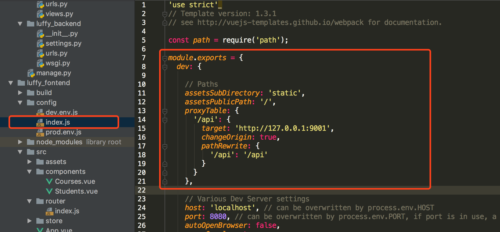

JQuery时代，我们使用ajax向后台提交数据请求，Vue时代，Axios提供了前端对后台数据请求的各种方式。

<!--more-->

#### 什么是Axios

Axios是基于Promise的Http客户端，可以在浏览器和node.js中使用。

#### 为什么使用Axios

Axios非常适合前后端数据交互，另一种请求后端数据的方式是vue-resource，vue-resource已经不再更新了，且只支持浏览器端使用，而Axios同时支持浏览器和Node端使用。

Vue开发者推荐使用更好的第三方工具，这就是Axios，详细的文件，请参考Evan You的[这篇文章](https://medium.com/the-vue-point/retiring-vue-resource-871a82880af4)。

#### 安装

Axios的安装支持多种方式

##### npm安装

```
npm install axios
```

##### cdn

```
<script src="https://cdn.bootcss.com/axios/0.18.0/axios.min.js"></script>
```

#### 使用方式介绍

接下来，我们使用Django，搭建一个后台程序，并使用Vue Cli搭建一个前端程序，使用Axios进行前后端数据交互。

###### 使用Vue Cli创建一个前端程序

```
vue init webpack luffy_fontend
```


###### 使用Django创建一个后端程序luffy_backend

```
django-admin startproject luffy_backend
```

###### 创建一个courses应用

```
cd luffy_backend
python manage.py startapp courses
```

###### 在models.py中创建两个类

```
from django.db import models

# Create your models here.


class Courses(models.Model):
    course_name = models.CharField(max_length=32)
    course_price = models.IntegerField()
    course_teacher = models.CharField(max_length=16)
    start_date = models.DateField(auto_now=True, null=False)
    end_date = models.DateField(auto_now=True, null=False)

    def __str__(self):
        return self.course_name


class Students(models.Model):
    student_name = models.CharField(max_length=16)
    student_id = models.IntegerField()
    student_phone = models.IntegerField()
    student_address = models.CharField(max_length=128)

```

###### 插入数据

```
// courses_courses
insert into courses_courses(course_name, course_price, course_teacher, start_date, end_date) values('Python全栈中级开发', 12800, 'Pizza', '2018-10-01', '2018-10-02');
insert into courses_courses(course_name, course_price, course_teacher, start_date, end_date) values('Python全栈高级开发', 19800, 'Alex', '2018-10-03', '2018-10-04');
insert into courses_courses(course_name, course_price, course_teacher, start_date, end_date) values('Linux高级运维', 12800, 'Oldboy', '2018-10-05', '2018-10-06');
insert into courses_courses(course_name, course_price, course_teacher, start_date, end_date) values('高级网络工程师', 12800, 'Egon', '2018-10-07', '2018-10-08');
insert into courses_courses(course_name, course_price, course_teacher, start_date, end_date) values('Go全栈高级开发', 12800, 'Yuan', '2018-10-09', '2018-10-10');
insert into courses_courses(course_name, course_price, course_teacher, start_date, end_date) values('Vue高级开发', 12800, 'Xiaoma', '2018-10-11', '2018-10-12');

// courses_students
insert into courses_students(id, student_name, student_id, student_phone, student_address) values(1, 'Alex', 100001, 1378061875, '北京市大兴区智障一中');
insert into courses_students(id, student_name, student_id, student_phone, student_address) values(2, 'Pizza', 100002, 1378161875, '北京市朝阳区第一中学');
insert into courses_students(id, student_name, student_id, student_phone, student_address) values(2, 'Egon', 100003, 1378261875, '北京市房山智障三中');
insert into courses_students(id, student_name, student_id, student_phone, student_address) values(4, 'Oldboy', 100004, 1378361875, '北京市大兴区智障三中');
insert into courses_students(id, student_name, student_id, student_phone, student_address) values(5, 'Yuanhao', 100005, 1378460275, '北京市丰台区智障四中');
insert into courses_students(id, student_name, student_id, student_phone, student_address) values(6, 'Jinxin', 100006, 1378560875, '北京市海淀区智障五中');
```

###### 在views.py中写好接口

```
from django.shortcuts import render, HttpResponse
from rest_framework.views import APIView

import json

from luffy_backend import settings
from .models import Courses
from .models import Students
# Create your views here.


class CoursesView(APIView):
    def get(self, request):
        print("Courses Get Methods Exec!")
        courses = list()

        for item in Courses.objects.all():

            course = {
                "course_name": item.course_name,
                "course_price": item.course_price,
                'course_teacher': item.course_teacher,
                'start_date': str(item.start_date),
                'end_date': str(item.end_date)
            }

            courses.append(course)

        print(courses)

        return HttpResponse(json.dumps(courses, ensure_ascii=False))


class StudentsView(APIView):
    def get(self, request):
        print("Student Get Methods Exec!")
        students = list()

        for item in Students.objects.all():
            student = {
                'student_name': item.student_name,
                'student_id': item.student_id,
                'student_phone': item.student_phone,
                'student_address': item.student_address
            }

            students.append(student)

        return HttpResponse(json.dumps(students, ensure_ascii=False))

    def post(self, request):
        print("Student Post Methods Exec!")
        print(request.body.decode('utf-8'))

        response = json.dumps(request.POST)
        return HttpResponse(response)
```

###### 定义接口


###### 配置后台接口

注意，修改配置文件后，需要重启前端服务器。



###### 在Vue Cli中使用axios

```
// The Vue build version to load with the `import` command
// (runtime-only or standalone) has been set in webpack.base.conf with an alias.
import Vue from 'vue'
import App from './App'
import router from './router'
import store from './store'
import axios from "axios"


Vue.prototype.$axios = axios;
Vue.config.productionTip = false;

new Vue({
  el: '#app',
  router,
  template: '<App></App>',
  components: {
    App
  },
  store: store
});
```

###### 获取课程信息

```
<template>
  <div>
    <span>这是课程详情页面</span>
    <button @click="getCourses">点击获取全部课程</button>
    <div v-if="isShow">
      <table border="1">
        <thead>
          <tr>
            <th>课程名称</th>
            <th>课程价格</th>
            <th>授课老师</th>
            <th>开课日期</th>
            <th>结课日期</th>
          </tr>
        </thead>
        <tbody>
          <tr v-for="(course, index) in courses" :key="index">
            <td>{{ course.course_name }}</td>
            <td>{{ course.course_price }}</td>
            <td>{{ course.course_teacher }}</td>
            <td>{{ course.start_date }}</td>
            <td>{{ course.end_date }}</td>
          </tr>
        </tbody>
      </table>
    </div>
  </div>

</template>

<script>
  export default {
    name: "Courses",
    data() {
      return {
        isShow: false,
        courses: []
      }
    },
    methods: {
      getCourses: function () {
        let ts = this;
        this.$axios.get('/api/course/1/')
        .then(function (response) {
          ts.isShow = true;
          ts.courses = response.data;
        })
        .catch(function (error) {
          console.log(error);
      });
      }
    }
  }
</script>

<style scoped>

</style>
```

###### 获取学生信息

```
<template>
  <div>
    <span>这是学员信息页面</span>
    <button @click="getStudents">点击获取学生信息</button>
    <button @click="changeStudents">点击修改学生信息</button>
    <div v-if="isShow">
      <table border="1">
      <thead>
        <tr>
          <th>学生ID</th>
          <th>学生姓名</th>
          <th>学生电话</th>
          <th>学生地址</th>
        </tr>
      </thead>
      <tbody>
        <tr v-for="(student, index) in students" :key="index">
          <td>{{ student.student_id }}</td>
          <td><input v-model="student.student_name"/></td>
          <td><input v-model="student.student_phone"/></td>
          <td><input v-model="student.student_address"/></td>
        </tr>
      </tbody>
    </table>
    </div>
  </div>
</template>

<script>
  export default {
    name: "Students",
    data() {
      return {
        isShow: false,
        students: []
      }
    },
    methods: {
      getStudents: function () {
        let ts = this;
        this.$axios.get('/api/student/1/')
          .then(function (response) {
            console.log(response);
            ts.isShow = true;
            ts.students = response.data;
          })
          .catch(function (error) {
            console.log(error);
          })
      },
      changeStudents: function () {
        let ts = this;
        this.$axios.post('/api/student/2/', {
          student_name: 1,
          student_id: 100001,
          student_phone: 1347658765,
          student_address: "北京市石景山区智障六中"
        })
          .then(function (response) {

          })
          .catch(function (error) {
            console.log(error);
          })
      }
    }
  }
</script>

<style scoped>

</style>

```

###### 处理跨域问题

发送post请求时，需要解决跨域问题，我们采用在Django中自定义一个处理跨域问题的中间件来解决这个问题。

```
from django.utils.deprecation import MiddlewareMixin


class MyCore(MiddlewareMixin):
    def process_response(self, request, response):
        response["Access-Control-Allow-Origin"] = '*'
        if request.method == 'OPTIONS':
            response["Access-Control-Allow-Headers"] = 'Content-Type'
            response["Access-Control-Allow-Methods"] = 'POST, DELETE, PUT'
        return response
```

以上，就是我们通过Axios的get和post请求与后台进行数据交互的全过程。