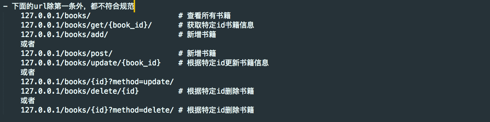
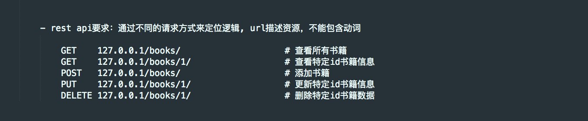
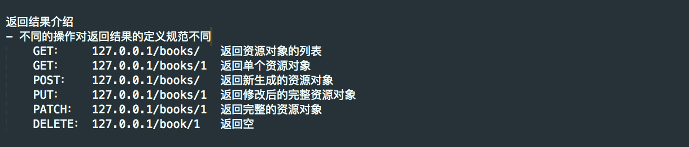
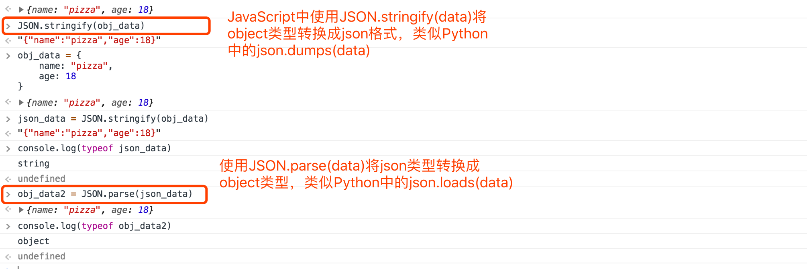
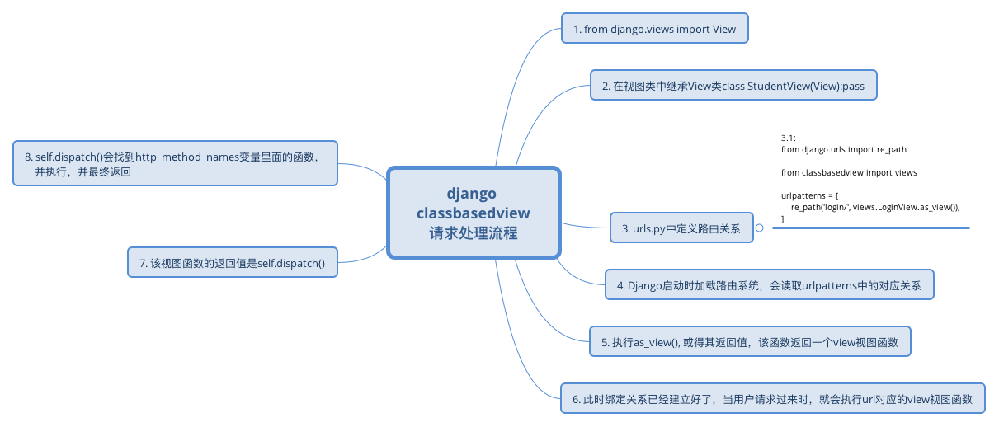
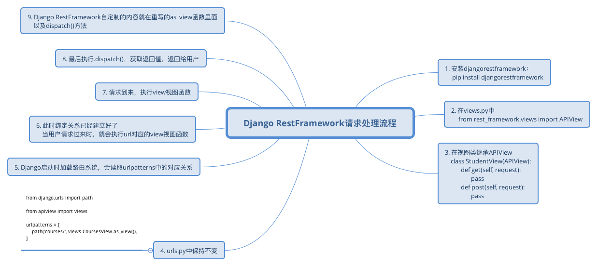
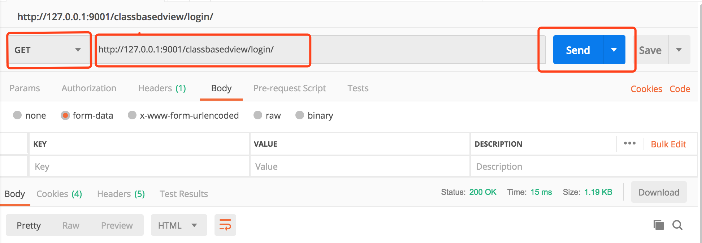
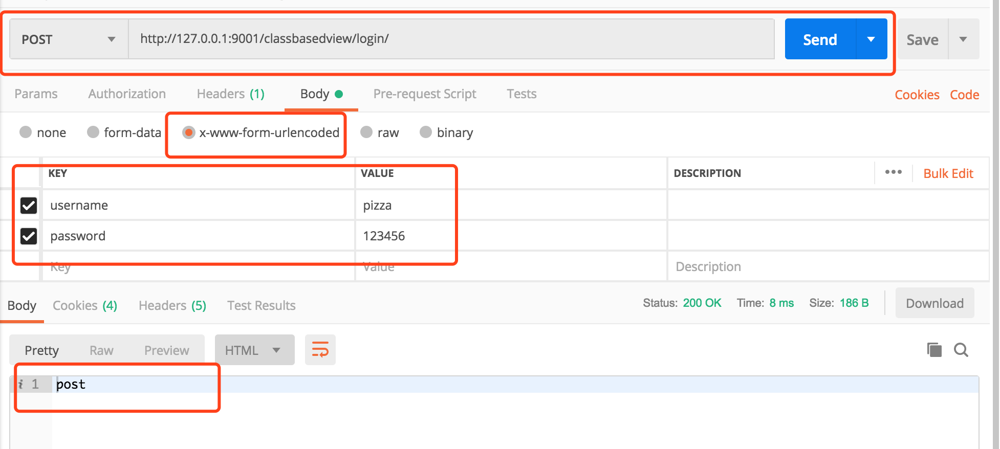
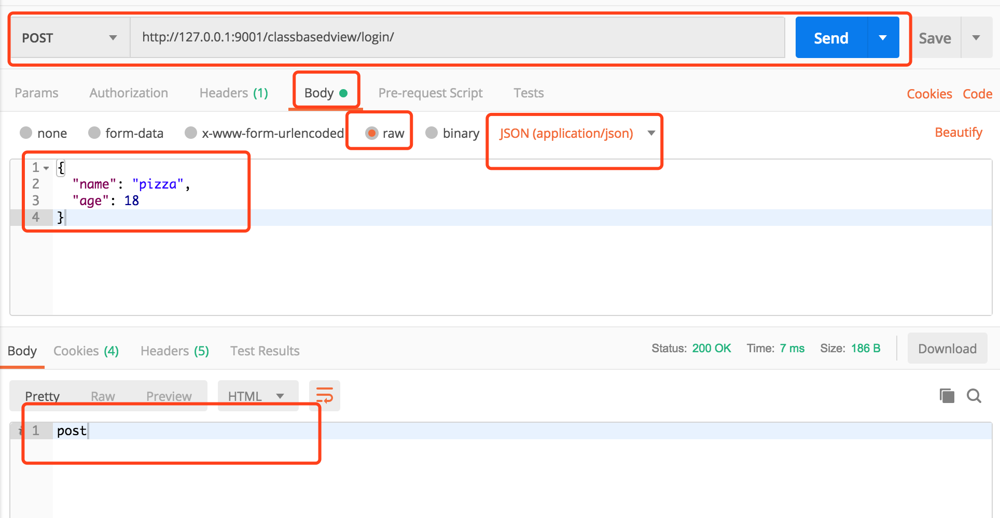

编程是数据结构和算法的结合，而在Web类型的App中，我们对于数据的操作请求是通过url来承载的，本文详细介绍了REST规范和CBV请求流程。

<!--more-->

编程是数据结构和算法的结合，小程序如简单的计算器，我们输入初始数据，经过计算，得到最终的数据，这个过程中，初始数据和结果数据都是数据，而计算过程是我们所说的广义上的算法。

大程序，如一个智能扫地机器人，我们可以设置打扫的距离，左右摆动的幅度来打扫房间，这里面打扫的举例，摆动幅度，都是数据，而打扫的过程是较为复杂的算法过程，总之，也是算法，即程序的实现方式。

另外，我们还可以设置打扫时间等等初始数据。

总之一句话，编程即数据结构和算法的结合。简单的程序可能不需要跟用户交互数据，但是现代的应用程序几乎都需要跟用户进行交互，不分应用程序类型，不管是CS型还是BS型的程序都是如此，而Python最擅长的Web App即BS型的程序，就是通过url和http来跟用户进行数据交互的，通过url和http请求，用户可以操作服务器端的程序，主要操作分为：增、删、改、查几类。

#### 引入

在开始之前，我们回顾一下咱们之前写过的图书管理系统项目，请仔细回想一下，对于该项目的设计，我们大概是以下面这种方式来实现的

##### 传统url设计风格

- url各式各样，设计混乱



理论上来说，这种方式完全可以实现我们的需求，但是一旦项目丰富起来，随着数据量增加，随着各个业务系统之间的逻辑关系不断的复杂，url会越来越复杂，理论上来说，不管是什么类型、什么名称的url都能指向具体的业务逻辑（视图函数），从而实现业务需求，但是如果没有明确的规范，因每个人的思维方式不一样、命名方式不一样而导致的url非常的乱，不方便项目的后期维护和扩展。

- 对于请求处理成功或者失败的返回信息没有明确的响应信息规范，返回给客户端的信息往往都是很随意的

以上这些情况的出现，导致了很多的问题，让互联网的世界变得杂乱不堪，日益复杂且臃肿。因此http协议创始人警告我们这些凡人们正在错误的使用http协议，除了警告，他还发表了一篇博客，大概意思就是教大家如何正确使用http协议，如何正确定义url，这就是REST（Representational State Transfer），不需要管这几个英文单词代表什么意思，只需要记住下面一句话：

- **用url唯一定位资源，用Http请求方式（GET, POST, DELETE, PUT)描述用户行为**

根据这句话，我们重新定义图书管理系统中的url

##### RESTful Api设计风格



可以看到，url非常简洁优雅，不包含任何操作，不包含任何动词，简简单单，用来描述服务器中的资源而已，服务器根据用户的请求方式对资源进行各种操作。而对数据的操作，最常见的就是CRUD（创建，读取，更新，删除），通过不同的请求方式，就足够描述这些操作方式了。如果不够用，Http还有其他的请求方式呢！比如：PATCH，OPTIONS，HEAD, TRACE, CONNECT。

##### REST定义返回结果



每一种请求方式的返回结果不同。

##### REST定义错误信息

```
{
    "error": "Invalid API key"
}
```

通过一个字典，返回错误信息。

这就是REST，上图中的url就是根据REST规范进行设计的RESTful api。

#### 今日概要

- classbasedview请求处理流程源码剖析
- djangorestframework APIView请求处理流程源码剖析
- postman工具介绍

#### 知识点复习回顾

- 上节回顾
- CBV
- classmethod和classonlymethod
- hasattr, getattr
- self定位
- Http请求协议
- form表单enctype
- JavaScript JSON格式转换

##### 知识点复习回顾一：基于类的视图（ClassBasedView）

请看如下代码，基于类的视图，需要通过视图类调用as_view()这个类方法，从而实现请求的分发。

urls.py部分：

```
from django.urls import path

from classbasedview import views

urlpatterns = [
    path('login/', views.LoginView.as_view()),
]
```

view.py部分

我们需要引入View这个类，from django.views import View

```
from django.shortcuts import render, HttpResponse
from django.views import View

# Create your views here.


class LoginView(View):
    def get(self, request):
        return render(request, 'classbasedview/login.html')

    def post(self, request):
        return HttpResponse("post")
```

这样就实现了一个基于类的视图，请大家以后都使用基于类的视图，这是生产环境中常用的一种方式，之前使用基于函数的视图，是为了方便大家学习理解，基于类的视图采用了面向对象编程思路，这种CBV的方式更加灵活，方便维护和扩展，以后，如果我们需要在url和处理请求的逻辑之间绑定关系的过程中自定制更多的操作，都会简单方便。后面的课程要介绍的Django RestFramework也正是依赖这种设计思路，来进行的功能扩展。

##### 知识点复习回顾二：classmethod和classonlymethod

在学习面向对象时，我们学习过classmethod，它是一个装饰器，表示允许类直接调用该方法而不用传入实例对象，如下代码所示：

```
# -*- coding: utf-8 -*-
from django.utils.decorators import classonlymethod

class Person(object):
    def __init__(self, name, age):
        self.name = name
        self.age = age

    def show_info(self):
        print("show info method been executed")

    @classmethod
    def show_info2(cls):
        print("show info2 method been executed")

    @classonlymethod
    def show_info3(cls):
        print("show info3 method been executed")


p1 = Person("pizza", 18)
# 普通方法可以通过实例对象和类调用
# 通过实例调用时默认传入self作为第一个参数，不需要手动传入参数
# 通过类调用时，必须手动指定实例对象传递给该方法
p1.show_info()
Person.show_info(p1)

# 被classmethod装饰器装饰后的方法可以通过实例对象和类直接调用
# 默认传入类名作为第一个参数
p1.show_info2()
Person.show_info2()

p1.show_info3()      # 报错，Django框架实现了classonlymethd，不再允许实例对象调用被该装饰器装饰的方法
Person.show_info3()
```

##### 知识点复习回顾三：hasattr、getattr、setattr

同样的，在学习面向对象时，我们学习过属性判断、属性查找、属性设置，接下来，再回顾一下：

```
class Person(object):
    def __init__(self, name, age):
        self.name = name
        self.age = age
        self._hobby = 'girls'

    def show_info(self):
        print("show info method been executed")


p1 = Person("pizza", 18)
# 查看该对象是否有show_info方法
print(hasattr(p1, "show_info"))
# 查看该对象是否有age属性
print(hasattr(p1, "age"))
print(hasattr(p1, "hahaha"))

greeting = "Hello World"
# 设置属性
setattr(p1, "hahaha", greeting)
print(hasattr(p1, "hahaha"))

func = getattr(p1, "show_info")
print(func)  # <bound method Person.show_info of <__main__.Person object at 0x102219d68>>
# 注意：直接调用，不需要传入self，getattr时已经绑定self到func了
func()

print(hasattr(Person, "show_info"))  # True
print(hasattr(Person, "name"))       # False
print(hasattr(Person, "country"))    # False
# 给Person类设置属性
setattr(Person, "country", "china")
print(hasattr(Person, "country"))    # True
print(hasattr(p1, "country"))        # True
```

##### 知识点复习回顾四：self定位

关于self到底指向哪里，我们再回顾一下：

```
# -*- coding: utf-8 -*-
class Request(object):

    def show_request(self):
        print(self)


class NewRequest(Request):

    def show_request(self):
        print(self)


request = NewRequest()
# 调用方法的实例对象是哪个，self就指向哪个对象
request.show_request()
```

##### 知识点复习回顾五：Http请求协议

Http请求报文包含三部分：分别是请求行、请求报文头、请求报文体

```
POST /classbasedview/login/ HTTP/1.1
Host: 127.0.0.1:9001
Connection: keep-alive
Content-Length: 114
Cache-Control: max-age=0
Origin: http://127.0.0.1:9001
Upgrade-Insecure-Requests: 1
Content-Type: application/x-www-form-urlencoded
User-Agent: Mozilla/5.0 (Macintosh; Intel Mac OS X 10_13_1) AppleWebKit/537.36 (KHTML, like Gecko) Chrome/70.0.3538.102 Safari/537.36
Accept: text/html,application/xhtml+xml,application/xml;q=0.9,image/webp,image/apng,*/*;q=0.8
Referer: http://127.0.0.1:9001/classbasedview/login/
Accept-Encoding: gzip, deflate, br
Accept-Language: zh-CN,zh;q=0.9,en;q=0.8
Cookie: csrftoken=xPHeedcs8duBuCv031bCvsG1zMX1aGNpKlsPdCkhQHICd4lvMeHIEwkpJUQbLiOl; is_login=True; username=alex; last_time="2018-11-24 13:37:33"; fruit=xiangjiao
```

注意：post请求类型有formdata，而get没有，下面详细介绍几个常见的请求头信息：

- POST /classbasedview/login/ HTTP/1.1：第一行表示请求行，分别是请求方式（POST），请求URL，HTTP协议版本
- HOST：请求行下面的都是请求报文，HOST表示请求的主机和端口号
- Connection：请求连接方式
- Content-Length：内容长度（字节）
- Content-Type：请求数据的编码协议，只有POST，DELETE等请求方式有该部分内容（需重点记忆）
- User-Agent：客户端信息
- Accept：可接受的响应内容类型
- Accept-Encoding：采用什么方式对请求数据进行编码
- Cookie：服务器端设置的cookie

下面是请求报文体：

```
csrfmiddlewaretoken=EqHslTSOeI6TWMXwmFCTuLLeflkjWSJTgUdLeFw1Xtxp5S1ea8vYo3IOX7DEPnO4&username=pizzali&password=aaa
```

不同的Content-Type，请求报文体的格式不一样，application/x-www-form-urlencoded使用&符合来拼接请求的键值对，最后，本质上，还是通过socket将以上内容编码成字节数据，发送到服务器端，服务器则根据Content-Encoding先将数据整体解码，之后再通过Content-Type指定的编码协议来读取请求数据。

通俗一点理解，我们可以使用任何连接符（&）或者（……），只要服务器端还客户端互相认可即可。因为协议就是为了方便沟通双方进行信息交互的。

##### 知识点复习回顾七：JavaScript JSON格式转换

最后，我们来复习一下JavaScript中的object数据类型和Json类型时间的互相转换，Json数据是网络传输中非常流行且使用广泛的数据格式，我们知道在Python中，将一个字典转换为Json格式，使用如下方式：

```
>>> dict_data = {
        "name": "Pizza",
        "age": 18
    }

>>> import json
# 通过json模块的json.dumps(data)方式将Python中的字典类型转换为json类型
>>> json_data = json.dumps(di)

>>> print(type(json_data))
<class 'str'>
```

而如何将Json数据转换为Python的字典类型呢？请看下面的代码：

```
# 通过json.loads(data)可以将json数据转换为Python中的字典类型
>>> dict_data2 = json.loads(json_data)

>>> print(type(dict_data2))
<class 'dict'>
```

那么在JavaScript中，如果实现将数据类型（数组，object）转换为Json类型呢？请看下图



#### 今日详细

##### 概念

REST是一种软件架构设计风格，不是标准，也不是具体的技术实现，只是提供了一组设计原则和约束条件。是目前最流行的 API 设计规范，用于 Web 数据接口的设计。2000年，由Roy Fielding在他的博士论文中提出，Roy Fielding是HTTP规范的主要编写者之一。

那么，我们所要讲的Django RestFramework与rest有什么关系呢？

其实，DRF(Django RestFramework)是一套基于Django开发的、帮助我们更好的设计符合REST规范的Web应用的一个Django App，所以，本质上，它是一个Django App。

##### 为什么使用DRF？

从概念就可以看出，有了这样的一个App，能够帮助我们更好的设计符合RESTful规范的Web应用，实际上，没有它，我们也能自己设计符合规范的Web应用。下面的代码演示如何手动实现符合RESTful规范的Web应用。

```
class CoursesView(View):
    def get(self, request):
        courses = list()

        for item in Courses.objects.all():
            course = {
                "title": item.title,
                "price": item.price,
                "publish_date": item.publish_date,
                "publish_id": item.publish_id
            }

            courses.append(course)

        return HttpResponse(json.dumps(courses, ensure_ascii=False))
```

如上代码所示，我们获取所有的课程数据，并根据REST规范，将所有资源的通过对象列表返回给用户。可见，就算没有DRF我们也能够设计出符合RESTful规范的接口甚至是整个Web App，但是，如果所有的接口都自定义，难免会出现重复代码，为了提高工作效率，我们建议使用优秀的工具。DRF就是这样一个优秀的工具，另外，它不仅仅能够帮助我们快速的设计符合REST规范的接口，还提供诸如认证、权限等等其他的强大功能。

##### 什么时候使用DRF？

前面提到，REST是目前最流行的 API 设计规范，如果使用Django开发你的Web应用，那么请尽量使用DRF，如果使用的是Flask，可以使用Flask-RESTful。

##### 开始使用DRF

###### DRF安装

[DRF官方文档](https://www.django-rest-framework.org/tutorial/quickstart/)中有详细介绍。使用如下命令安装，首先安装Django，然后安装DRF：

```
>>> pip install django
>>> pip install djangorestframework
```

安装完成之后，我们就可以开始使用DRF框架来实现咱们的Web应用了，这部分内容包括如下知识点：

- APIView
- 解析器组件
- 序列化组件
- 视图组件
- 认证组件
- 权限组件
- 频率控制组件
- 分页组件
- 响应器组件
- url控制器

介绍DRF，必须要介绍APIView，它是重中之重，是下面所有组件的基础，因为所有的请求都是通过它来分发的，至于它究竟是如何分发请求的呢？想要弄明白这个问题，我们就必须剖析它的源码，而想要剖析DRF APIView的源码，我们需要首先剖析django中views.View类的源码，为什么使用视图类调用as_view()之后，我们的请求就能够被不同的函数处理呢？接下来请同学们思考十分钟时间，自己尝试分析一下django中views.View类的源码？稍后我请同学来描述一下整个流程。

###### Django View请求流程源码

好了，同学们，接下来，我们一起来分析一下django中views.View类的源码。请看下图：



请仔细回想我们前面回顾的知识点，源码中最后会通过getattr在self中查找request.method.lower()，也就是get、post或者delete这些方法中的一个，那么，self是谁，就是至关重要的一点，前面讲到过，谁调用类中的方法，self就指向谁，此时，一层层往回找，我们会发现，self = cls(**initkwargs)，self就是我们视图类的实例化对象，所以，dispatch函数肯定会到该视图类中找对应的方法（get或者post）。

接下来是提问时间，请问如果有如下函数，我想通过不修改函数内容的情况下，如何给函数新增一个统计执行时间的功能：

```
def outer(func):
    def inner(*args, **kwargs):
        import time
        start_time = time.time()
        ret = func(*args, **kwargs)
        end_time = time.time()
        print("This function elapsed %s" % str(end_time - start_time))
        return ret
    return inner


@outer
def add(x, y):
    return x + y
```

这是函数，如果是类呢？面向对象编程，如何扩展你的程序，比如有如下代码：

```
class Person(object):
    def show(self):
        print("Person's show method executed!")
        

class MyPerson(Person):
    def show(self):
        print("MyPerson's show method executed")
        super().show()
        

mp = MyPerson()
mp.show()
```

这就是面向对象的程序扩展，现在大家是否对面向对象有了更加深刻的认识呢？接下来给大家十分钟时间，消化一下上面两个概念，然后请思考，那么假设你是Django RestFramework的开发者，你想自定制一些自己想法，如何实现。

好了，相信大家都已经有了自己的想法，接下来，我们一起来分析一下，Django RestFramework的APIView是如何对Django框架的View进行功能扩展的。

```
from django.shortcuts import HttpResponse

import json

from .models import Courses

# 引入APIView
from rest_framework.views import APIView
# Create your views here.


class CoursesView(APIView):  # 继承APIView而不是原来的View
    def get(self, request):
        courses = list()

        for item in Courses.objects.all():
            course = {
                "title": item.title,
                "description": item.description
            }

            courses.append(course)

        return HttpResponse(json.dumps(courses, ensure_ascii=False))
```

###### DRF APIView请求流程源码

其他的保持不变，完整的请求流程请看下图：



以上就是Django RestFramework APIView的请求处理流程，我们可以通过重写dispatch()方法或者重写as_view()方法来自定制自己的想法。

那么，Django RestFramework到底自定制了哪些内容呢？在本文的最开始，我们已经介绍过了，就是那些组件，比如解析器组件、序列化组件、权限、频率组件等。

###### Ajax发送Json数据给服务器

接下来，我们就开始介绍Django RestFramework中的这些组件，首先，最基本的，就是解析器组件，在介绍解析器组件之前，我提一个问题，请大家思考，如何发送Json格式的数据给后端服务器？

好了，时间到，请看下面的代码，通过ajax请求，我们可以发送json格式的数据到后端：

```
<!DOCTYPE html>
<html lang="en">
<head>
  <meta charset="UTF-8">
  <title>Title</title>
  <script src="https://cdn.bootcss.com/jquery/3.3.1/jquery.min.js"></script>
  <script src="/static/jquery-1.10.2.min.js"></script>
</head>
<body>
  <form action="" method="post" enctype="application/x-www-form-urlencoded">
    
    用户名: <input type="text" name="username"/>
    密码:  <input type="password" name="password"/>
    提交:  <input type="submit" value="提交"/>
  </form>

  <hr>
  <button class="btn">点击发送Ajax请求</button>

  <script>
    $(".btn").click(function () {
      $.ajax({
        url: '',
        type: 'post',
        contentType: 'application/json',
        data: JSON.stringify({
          username: "alex",
          password: 123
        }
        ),
        success: function (data) {
          console.log(data);
        }
      })
    })

  </script>

</body>
</html>
```

通过上文的知识点复习我们已经知道，Content-Type用来定义发送数据的编码协议，所以，在上面的代码中，我们指定Content-Type为application/json，即可将我们的Json数据发送到后端，那么后端如何获取呢？

###### 服务器对Json数据的处理方式

按照之前的方式，我们使用request.POST, 如果打印该值，会发现是一个空对象：request post <QueryDict: {}>，该现象证明Django并不能处理请求协议为application/json编码协议的数据，我们可以去看看request源码，可以看到下面这一段：

```
        if self.content_type == 'multipart/form-data':
            if hasattr(self, '_body'):
                # Use already read data
                data = BytesIO(self._body)
            else:
                data = self
            try:
                self._post, self._files = self.parse_file_upload(self.META, data)
            except MultiPartParserError:
                # An error occurred while parsing POST data. Since when
                # formatting the error the request handler might access
                # self.POST, set self._post and self._file to prevent
                # attempts to parse POST data again.
                # Mark that an error occurred. This allows self.__repr__ to
                # be explicit about it instead of simply representing an
                # empty POST
                self._mark_post_parse_error()
                raise
        elif self.content_type == 'application/x-www-form-urlencoded':
            self._post, self._files = QueryDict(self.body, encoding=self._encoding), MultiValueDict()
        else:
            self._post, self._files = QueryDict(encoding=self._encoding), MultiValueDict()
```

可见Django原生解析器并不处理application/json编码协议的数据请求，好了，有了这样的认识之后，咱们就可以开始正式介绍DRF的解析器了，解析器，顾名思义，就是用来解析数据的请求的。

不过我们将在下一节课介绍Django RestFramework的解析器组件。虽然Django的原生解析器不支持application/json编码协议，但是我们可以通过拿到原始的请求数据（request.body）来手动处理application/json请求，虽然这种方式不方便，也并不推荐，请看如下代码：

```
class LoginView(View):
    def get(self, request):
        return render(request, 'classbasedview/login.html')

    def post(self, request):
        print(request.POST)  # <QueryDict: {}>
        print(request.body)  # b'{"username":"alex","password":123}'
        data = request.body.decode('utf-8')
        dict_data = json.loads(data)

        username = dict_data['username']
        password = dict_data['password']

        return HttpResponse(json.dumps(dict_data))
```

通过上面的代码，我们可以通过request.body手动处理application/json请求，不过，如上文所说，并不推荐。

#### postman工具介绍

今天最后一项内容，就是postman这个工具的介绍，我们通过postman来模拟用户请求，简单方便，不再需要使用浏览器来发请求了。

##### 安装postman

从[POSTMAN官网](https://www.getpostman.com/)下载之后安装即可。

##### 发送get请求

请看下面的图片：

如图所示，在下拉框中选择GET方式发送请求，在地址栏输入请求url，然后点击**send**发送即可发送GET请求到后端服务器。

##### 以urlencoded协议发送post请求

请看下图：

选择POST，输入地址，然后在下面的选项框中选择**Body，**之后选择x-www-form-urlencoded协议，输入key和value，点击Send，即可以urlencoded方式发送post请求，并且在最下面的提示框中可以查看到服务器返回的信息。

##### 以json协议发送post请求

最后，请看下图，以Json协议发送POST请求：



前面都一致，在Body框中，选择raw选项，然后选择application/json，最后输入Json格式的数据，点击Send即可以Json协议发送POST请求。

#### 今日总结

- classbasedview请求处理流程源码剖析
- djangorestframework APIView请求处理流程源码剖析
- postman工具介绍

#### 作业

作业一：将把Django中views.View的请求处理流程用流程图详细会出来。

作业二：将Django RestFramework APIView的请求处理流程用流程图详细画出来。