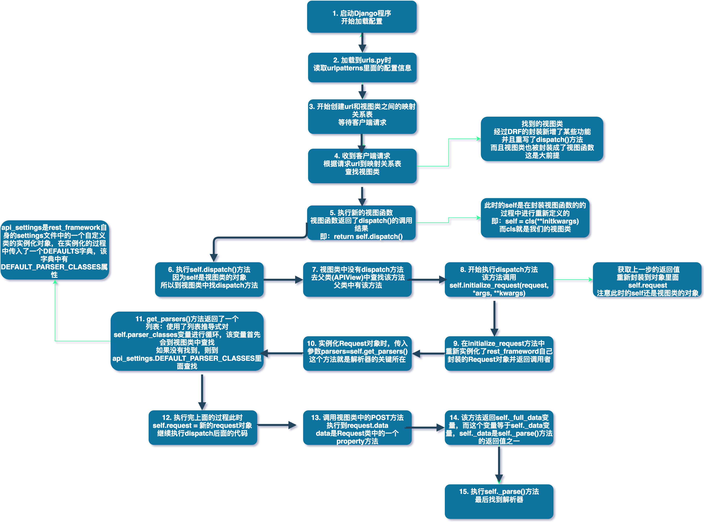

通过上一节课的学习，我们已经有了一个共识，Django无法处理application/json协议请求的数据，即，如果用户通过application/json协议发送请求数据到达Django服务器，我们通过request.POST获取到的是一个空对象。

<!--more-->

#### 引入

Django RestFramework帮助我们实现了处理application/json协议请求的数据，另外，我们也提到，如果不使用DRF，直接从request.body里面拿到原始的客户端请求的字节数据，经过decode，然后json反序列化之后，也可以得到一个Python字典类型的数据。

但是，这种方式并不被推荐，因为已经有了非常优秀的第三方工具，那就是Django RestFramework的解析器组件，这是我们今天要学习的第一个非常重要的知识点，咱们今天要学习的另一个也是至关重要的知识点叫做序列化组件。

序列化在上一节课中也已经提到了，帮助我们快速的进行符合规范的接口开发，也就是增删改查接口，包含错误信息定义，成功之后的返回信息定义等等。

接下来，咱们就开始学习DRF的这两个重要组件。

#### 今日概要

- 解析器组件的使用及源码剖析
- 序列化组件的使用及RESTful接口设计

#### 知识点复习回顾

- 昨日回顾
- 三元运算
- 列表推导式
- __getattr__
- Django settings文件查找顺序
- 动态import
- Django原生serializer

##### 知识点复习回顾一：三元运算

三元运算能够简化我们的代码，请看如下代码：

```python
# 定义两个变量
a = 1
b = 2
# 判断a的真假值，如果为True，则将判断表达式的前面的值赋给c，否则将判断表达式后面的值赋给c
c = a if a else b

print(c) # 1  # 因为a的真假值判断为True，所以c为1
# 定义两个变量
a = 0
b = 2
# 判断a的真假值，如果为True，则将判断表达式的前面的值赋给c，否则将判断表达式后面的值赋给c
c = a if a else b

print(c) # 2  # 因为a的真假值判断为False，所以c为2
```

##### 知识点复习回顾二：列表推导式

列表推导式的返回结果仍然是一个列表，假设有列表li = [1, 2, 3, 4],  请同学们思考，如果将li列表里面的每一个元素乘以2得到一个新的列表，请看下面的代码：

```python
li = [1, 2, 3, 4]
# 方式一：使用普通for循环
new_list = list()
for item in li:
    new_list.append(item * 2)

# 方式二：使用列表推导式
li = [ x * 2 for x in li]
```

可见，列表推导式能够大大简化代码，再看下面的代码：

```python
class JsonParser(object):
    pass


class FormParser(object):
    pass


class Parser(object):
    parser_classes = [JsonParser, FormParser]

    def _get_parse(self):
        parser_list = [parser() for parser in self.parser_classes]
        return parser_list


parser = Parser()
parser_list = parser._get_parse()
print(parser_list)  # [<__main__.JsonParser object at 0x103f07048>, <__main__.FormParser object at 0x103f072e8>]
```

可以看到，parser_list是parser_classes中每个类的实例化对象列表。以上就是关于列表推导式的回顾。

##### 知识点复习回顾三：__getattr__

在学习面向对象时，我们知道可以通过对象加点号获取该对象的属性，也可以通过对象的__dict__访问属性，请看下面的代码：

```python
class Father(object):
    country = "china"


class Person(Father):
    def __init__(self, name, age):
        self.name = name
        self.age = age


p = Person("pizza", 18)
print(p.__dict__)       # {'name': 'pizza', 'age': 18}
print(Person.__dict__)  # {'__module__': '__main__', '__init__': <function Person.__init__ at 0x103f132f0>, '__doc__': None}
print(p.name)           # pizza
print(p.age)            # 18
print(p.country)        # china 如果对象不存在这个属性，则会到其父类中查找这个属性
print(p.hobby)          # 如果在父类中也找不到这个属性，则会报错：AttributeError: 'Person' object has no attribute 'hobby'
```

对象的属性查找首先会在该对象的一个名为__dict__的字典中查找这个属性，如果找不到，则会到其父类中查找这个属性，如果在父类中都也找不到对应的属性，这会抛出异常AttributeError，我们可以通过在类中定义一个__getattr__来重定向未查找到属性后的行为，请看下面的代码：

```python
class Father(object):
    country = "china"


class Person(Father):
    def __init__(self, name, age):
        self.name = name
        self.age = age

    def __getattr__(self, value):
        raise ValueError("属性%s不存在" % value)


p = Person("pizza", 18)
print(p.hobby)  # ValueError: 属性hobby不存在
```

可以看到，我们能够重新定义异常，也可以做其他任何事情，这就是__getattr__，一句话总结，通过对象查找属性，如果找不到属性，且该对象有__getattr__方法，那么__getattr__方法会被执行，至于执行什么逻辑，我们可以自定义。

##### 知识点复习回顾四：Django settings文件查找顺序

同学们在使用Django的时候，应该是经常会用到它的settings文件，通过在settings文件里面定义变量，我们可以在程序的任何地方使用这个变量，方便好用，比如，假设我在settings里面定义了一个变量NAME="Pizza", 虽然可以在项目的任何地方使用：

```
>>> from drf_server import settings
>>> print(settings.NAME) # Pizza
```

但是，这种方式并不是被推荐和建议的，因为除了项目本身的settings文件之外，Django程序本身也有许多配置变量，都存储在django/conf/global_setting.py模块里面，包括缓存、数据库、秘钥等，如果我们只是from drf_server import settings导入了项目本身的配置信息，当需要用到Django默认的配置信息的时候，还需要再次导入，from django.conf import settings，所以建议的使用方式是：

```
>>> from django.conf import settings
>>> print(settings.NAME)
```

使用上面的方式，我们除了可以使用自定义的配置信息(NAME)外，还可以使用global_settings中的配置信息，不需要重复导入，Django查找变量的顺序是先从用户的settings里面查找，然后在global_settings中查找，如果用户的settings中找到了，则不会继续查找global_settings中的配置信息，假设我在用户的settings里面定义了NAME="Pizza", 在global_settings中定义了NAME="Alex"，请看下面的打印结果：

```
>>> from django.conf import settings
>>> print(settings.NAME) # Pizza
```

可见，这种方式更加灵活高效，建议大家使用。

##### 知识点复习回顾五：Django原生serializer

上一节课讲到，我们可以自定义符合REST规范的接口，请看下面的代码：

```python
from django.db import models

# Create your models here.


class Courses(models.Model):
    title = models.CharField(max_length=32)
    description = models.CharField(max_length=128)
```

```python
class CoursesView(View):
    def get(self, request):
        courses = list()

        for item in Courses.objects.all():
            course = {
                "title": item.title,
                "description": item.description
            }

            courses.append(course)

        return HttpResponse(json.dumps(courses, ensure_ascii=False))
```

通过上面的方式，我们定义出了符合规范的返回数据，加上符合规范的url，我们可以说，手动方式进行REST开发也是完全没有问题的，但是，企业最注重的是开发效率，而不是程序员实现需求的方式，理论上来说，我们可以通过任何方式，但是我们应该尽可能的采用高效的、灵活的、强大的工具来帮助我们完成重复的事情，所以我们需要学习DRF，它提供了很多的功能，在讲DRF的序列化之前，我们来了解另一个知识，那就是，Django框架原生的序列化功能，即Django原生serializer，它的使用方式如下：

```python
from django.core.serializers import serialize

class StudentView(APIView):

    def get(self, request):
       
        origin_students = Student.objects.all()
        serialized_students = serialize("json", origin_students)

        return HttpResponse(serialized_students)
```

使用方式非常简单，导入模块之后，将需要的格式和queryset传给serialize进行序列化，然后返回序列化后的数据。

如果你的项目仅仅只是需要序列化一部分数据，不需要用到诸如认证、权限等等其他功能，可以使用Django原生serializer，否则建议使用DRF。

#### 今日详细

好了，接下来，铺垫都做好了，剖析源码所需要的准备工作都已经做好了，接下来，我们就进入今天的新内容的学习，也就是解析器组件和序列化组件的使用及其源码剖析。

##### 解析器组件

###### 解析器组件的使用

首先，来看看解析器组件的使用，稍后我们一起剖析其源码：

```python
from django.http import JsonResponse

from rest_framework.views import APIView
from rest_framework.parsers import JSONParser, FormParser
# Create your views here.


class LoginView(APIView):
    parser_classes = [FormParser]

    def get(self, request):
        return render(request, 'parserver/login.html')

    def post(self, request):
        # request是被drf封装的新对象，基于django的request
        # request.data是一个property，用于对数据进行校验
        # request.data最后会找到self.parser_classes中的解析器
        # 来实现对数据进行解析
        
        print(request.data)  # {'username': 'alex', 'password': 123}

        return JsonResponse({"status_code": 200, "code": "OK"})
```

使用方式非常简单，分为如下两步：

- from rest_framework.views import APIView
- 继承APIView
- 直接使用request.data就可以获取Json数据

如果你只需要解析Json数据，不允许任何其他类型的数据请求，可以这样做：

- from rest_framework.parsers import JsonParser
- 给视图类定义一个parser_classes变量，值为列表类型[JsonParser]
- 如果parser_classes = [], 那就不处理任何数据类型的请求了

问题来了，这么神奇的功能，DRF是如何做的？因为昨天讲到Django原生无法处理application/json协议的请求，所以拿json解析来举例，请同学们思考一个问题，如果是你，你会在什么地方加入新的Json解析功能？

首先，需要明确一点，我们肯定需要在request对象上做文章，为什么呢？因为只有有了用户请求，我们的解析才有意义，没有请求，就没有解析，更没有处理请求的逻辑，所以，我们需要弄明白，在整个流程中，request对象是什么时候才出现的，是在绑定url和处理视图之间的映射关系的时候吗？我们来看看源码：

```python
@classonlymethod
def as_view(cls, **initkwargs):
    """Main entry point for a request-response process."""
    for key in initkwargs:
        if key in cls.http_method_names:
            raise TypeError("You tried to pass in the %s method name as a "
                            "keyword argument to %s(). Don't do that."
                            % (key, cls.__name__))
            if not hasattr(cls, key):
                raise TypeError("%s() received an invalid keyword %r. as_view "
                                "only accepts arguments that are already "
                                "attributes of the class." % (cls.__name__, key))

def view(request, *args, **kwargs):
    self = cls(**initkwargs)
    if hasattr(self, 'get') and not hasattr(self, 'head'):
        self.head = self.get
        self.request = request
        self.args = args
        self.kwargs = kwargs
        return self.dispatch(request, *args, **kwargs)
    view.view_class = cls
    view.view_initkwargs = initkwargs

    # take name and docstring from class
    update_wrapper(view, cls, updated=())

    # and possible attributes set by decorators
    # like csrf_exempt from dispatch
    update_wrapper(view, cls.dispatch, assigned=())
    return view
```

看到了吗？在执行view函数的时候，那么什么时候执行view函数呢？当然是请求到来，根据url查找映射表，找到视图函数，然后执行view函数并传入request对象，所以，如果是我，我可以在这个视图函数里面加入处理application/json的功能：

```python
@classonlymethod
def as_view(cls, **initkwargs):
    """Main entry point for a request-response process."""
    for key in initkwargs:
        if key in cls.http_method_names:
            raise TypeError("You tried to pass in the %s method name as a "
                            "keyword argument to %s(). Don't do that."
                            % (key, cls.__name__))
            if not hasattr(cls, key):
                raise TypeError("%s() received an invalid keyword %r. as_view "
                                "only accepts arguments that are already "
                                "attributes of the class." % (cls.__name__, key))

def view(request, *args, **kwargs):
    if request.content_type == "application/json":
        import json
        return HttpResponse(json.dumps({"error": "Unsupport content type!"}))

    self = cls(**initkwargs)
    if hasattr(self, 'get') and not hasattr(self, 'head'):
        self.head = self.get
        self.request = request
        self.args = args
        self.kwargs = kwargs
        return self.dispatch(request, *args, **kwargs)
    view.view_class = cls
    view.view_initkwargs = initkwargs

    # take name and docstring from class
    update_wrapper(view, cls, updated=())

    # and possible attributes set by decorators
    # like csrf_exempt from dispatch
    update_wrapper(view, cls.dispatch, assigned=())
    return view
```

看到了吧，然后我们试试发送json请求，看看返回结果如何？是不是非常神奇？事实上，你可以在这里，也可以在这之后的任何地方进行功能的添加。

那么，DRF是如何做的呢？我们在使用的时候只是继承了APIView，然后直接使用request.data，所以，我斗胆猜测，功能肯定是在APIView中定义的，废话，具体在哪个地方呢？接下来，我们一起来分析一下DRF解析器源码，看看DRF在什么地方加入了这个功能，上节课，我们通过面向对象的方式，给类的某个方法新增了功能，调用重写的方法，就实现了功能扩展，但是上面除了request.data，我们没有调用任何新的方法，所以，问题就在这个request.data上，它绝不仅仅是一个普通的对象属性。

好了，有了这个共同的认识，我们接下来验证一下我们的看法。

###### 解析器组件源码剖析

请看下图：




上图详细描述了整个过程，最重要的就是重新定义的request对象，和parser_classes变量，也就是我们在上面使用的类变量。好了，通过分析源码，验证了我们的猜测。

##### 序列化组件

###### 序列化组件的使用

定义几个 model:

```python
from django.db import models

# Create your models here.


class Publish(models.Model):
    nid = models.AutoField(primary_key=True)
    name = models.CharField(max_length=32)
    city = models.CharField(max_length=32)
    email = models.EmailField()

    def __str__(self):
        return self.name


class Author(models.Model):
    nid = models.AutoField(primary_key=True)
    name = models.CharField(max_length=32)
    age = models.IntegerField()

    def __str__(self):
        return self.name


class Book(models.Model):
    title = models.CharField(max_length=32)
    publishDate = models.DateField()
    price = models.DecimalField(max_digits=5, decimal_places=2)
    publish = models.ForeignKey(to="Publish", to_field="nid", on_delete=models.CASCADE)
    authors = models.ManyToManyField(to="Author")

    def __str__(self):
        return self.title
```

###### 通过序列化组件进行GET接口设计

首先，设计url，本次我们只设计GET和POST两种接口：

```python
from django.urls import re_path

from serializers import views

urlpatterns = [
    re_path(r'books/$', views.BookView.as_view())
]
```

我们新建一个名为app_serializers.py的模块，将所有的序列化的使用集中在这个模块里面，对程序进行解耦：

```python
# -*- coding: utf-8 -*-
from rest_framework import serializers

from .models import Book


class BookSerializer(serializers.Serializer):
    title = serializers.CharField(max_length=128)
    publish_date = serializers.DateTimeField()
    price = serializers.DecimalField(max_digits=5, decimal_places=2)
    publish = serializers.CharField(max_length=32)
    authors = serializers.CharField(max_length=32)
```

接着，使用序列化组件，开始写视图类：

```python
# -*- coding: utf-8 -*-
from rest_framework.views import APIView
from rest_framework.response import Response

# 当前app中的模块
from .models import Book
from .app_serializer import BookSerializer

# Create your views here.

class BookView(APIView):
    def get(self, request):
        origin_books = Book.objects.all()
        serialized_books = BookSerializer(origin_books, many=True)

        return Response(serialized_books.data)
```

如此简单，我们就已经，通过序列化组件定义了一个符合标准的接口，定义好model和url后，使用序列化组件的步骤如下：

- 导入序列化组件：from rest_framework import serializers
- 定义序列化类，继承serializers.Serializer(建议单独创建一个专用的模块用来存放所有的序列化类)：class BookSerializer(serializers.Serializer):pass
- 定义需要返回的字段(字段类型可以与model中的类型不一致，参数也可以调整)，字段名称必须与model中的一致
- 在GET接口逻辑中，获取QuerySet
- 开始序列化：将QuerySet作业第一个参数传给序列化类，many默认为False，如果返回的数据是一个列表嵌套字典的多个对象集合，需要改为many=True
- 返回：将序列化对象的data属性返回即可

上面的接口逻辑中，我们使用了Response对象，它是DRF重新封装的响应对象。该对象在返回响应数据时会判断客户端类型（浏览器或POSTMAN），如果是浏览器，它会以web页面的形式返回，如果是POSTMAN这类工具，就直接返回Json类型的数据。

此外，序列化类中的字段名也可以与model中的不一致，但是需要使用source参数来告诉组件原始的字段名，如下：

```python
class BookSerializer(serializers.Serializer):
    BookTitle = serializers.CharField(max_length=128, source="title")
    publishDate = serializers.DateTimeField()
    price = serializers.DecimalField(max_digits=5, decimal_places=2)
    # source也可以用于ForeignKey字段
    publish = serializers.CharField(max_length=32, source="publish.name")
    authors = serializers.CharField(max_length=32)
```

下面是通过POSTMAN请求该接口后的返回数据，大家可以看到，除ManyToManyField字段不是我们想要的外，其他的都没有任何问题：

```python
[
    {
        "title": "Python入门",
        "publishDate": null,
        "price": "119.00",
        "publish": "浙江大学出版社",
        "authors": "serializers.Author.None"
    },
    {
        "title": "Python进阶",
        "publishDate": null,
        "price": "128.00",
        "publish": "清华大学出版社",
        "authors": "serializers.Author.None"
    }
]
```

那么，多对多字段如何处理呢？如果将source参数定义为"authors.all"，那么取出来的结果将是一个QuerySet，对于前端来说，这样的数据并不是特别友好，我们可以使用如下方式：

```python
class BookSerializer(serializers.Serializer):
    title = serializers.CharField(max_length=32)
    price = serializers.DecimalField(max_digits=5, decimal_places=2)
    publishDate = serializers.DateField()
    publish = serializers.CharField()
    publish_name = serializers.CharField(max_length=32, read_only=True, source='publish.name')
    publish_email = serializers.CharField(max_length=32, read_only=True, source='publish.email')
    # authors = serializers.CharField(max_length=32, source='authors.all')
    authors_list = serializers.SerializerMethodField()

    def get_authors_list(self, authors_obj):
        authors = list()
        for author in authors_obj.authors.all():
            authors.append(author.name)

        return authors
```

请注意，get_必须与字段名称一致，否则会报错。

###### 通过序列化组件进行POST接口设计

接下来，我们设计POST接口，根据接口规范，我们不需要新增url，只需要在视图类中定义一个POST方法即可，序列化类不需要修改，如下：

```python
# -*- coding: utf-8 -*-
from rest_framework.views import APIView
from rest_framework.response import Response

# 当前app中的模块
from .models import Book
from .app_serializer import BookSerializer

# Create your views here.


class BookView(APIView):
    def get(self, request):
        origin_books = Book.objects.all()
        serialized_books = BookSerializer(origin_books, many=True)

        return Response(serialized_books.data)

    def post(self, request):
        verified_data = BookSerializer(data=request.data)

        if verified_data.is_valid():
            book = verified_data.save()
            # 可写字段通过序列化添加成功之后需要手动添加只读字段
            authors = Author.objects.filter(nid__in=request.data['authors'])
            book.authors.add(*authors)

            return Response(verified_data.data)
        else:
            return Response(verified_data.errors)
```

POST接口的实现方式，如下：

- url定义：需要为post新增url，因为根据规范，url定位资源，http请求方式定义用户行为
- 定义post方法：在视图类中定义post方法
- 开始序列化：通过我们上面定义的序列化类，创建一个序列化对象，传入参数data=request.data（application/json）数据
- 校验数据：通过实例对象的is_valid()方法，对请求数据的合法性进行校验
- 保存数据：调用save()方法，将数据插入数据库
- 插入数据到多对多关系表：如果有多对多字段，手动插入数据到多对多关系表
- 返回：将插入的对象返回

请注意，因为多对多关系字段是我们自定义的，而且必须这样定义，返回的数据才有意义，而用户插入数据的时候，serializers.Serializer没有实现create，我们必须手动插入数据，就像这样：

```python
# 第二步， 创建一个序列化类，字段类型不一定要跟models的字段一致
class BookSerializer(serializers.Serializer):
    # nid = serializers.CharField(max_length=32)
    title = serializers.CharField(max_length=128)
    price = serializers.DecimalField(max_digits=5, decimal_places=2)
    publish = serializers.CharField()
    # 外键字段, 显示__str__方法的返回值
    publish_name = serializers.CharField(max_length=32, read_only=True, source='publish.name')
    publish_city = serializers.CharField(max_length=32, read_only=True, source='publish.city')
    # authors = serializers.CharField(max_length=32) # book_obj.authors.all()

    # 多对多字段需要自己手动获取数据，SerializerMethodField()
    authors_list = serializers.SerializerMethodField()

    def get_authors_list(self, book_obj):
        author_list = list()

        for author in book_obj.authors.all():
            author_list.append(author.name)

        return author_list

    def create(self, validated_data):
        # {'title': 'Python666', 'price': Decimal('66.00'), 'publish': '2'}
        validated_data['publish_id'] = validated_data.pop('publish')
        book = Book.objects.create(**validated_data)

        return book

    def update(self, instance, validated_data):
        # 更新数据会调用该方法
        instance.title = validated_data.get('title', instance.title)
        instance.publishDate = validated_data.get('publishDate', instance.publishDate)
        instance.price = validated_data.get('price', instance.price)
        instance.publish_id = validated_data.get('publish', instance.publish.nid)

        instance.save()

        return instance
```

这样就会非常复杂化程序，如果我希望序列化类自动插入数据呢？

这是问题一：如何让序列化类自动插入数据？

另外问题二：如果字段很多，那么显然，写序列化类也会变成一种负担，有没有更加简单的方式呢？

答案是肯定的，我们可以这样做：

```python
class BookSerializer(serializers.ModelSerializer):
    class Meta:
        model = Book

        fields = ('title',
                  'price',
                  'publish',
                  'authors',
                  'author_list',
                  'publish_name',
                  'publish_city'
                  )
        extra_kwargs = {
            'publish': {'write_only': True},
            'authors': {'write_only': True}
        }

    publish_name = serializers.CharField(max_length=32, read_only=True, source='publish.name')
    publish_city = serializers.CharField(max_length=32, read_only=True, source='publish.city')

    author_list = serializers.SerializerMethodField()

    def get_author_list(self, book_obj):
        # 拿到queryset开始循环 [{}, {}, {}, {}]
        authors = list()

        for author in book_obj.authors.all():
            authors.append(author.name)

        return authors
```

步骤如下：

- 继承ModelSerializer：不再继承Serializer
- 添加extra_kwargs类变量：extra_kwargs = {'publish': {'write_only': True}}

使用ModelSerializer完美的解决了上面两个问题。好了，这就是今天的全部内容。

#### 今日总结

- 解析器组件的使用及源码剖析
- 序列化组件的使用及RESTful接口设计

#### 作业

请将今天的内容全部自己写出来，包括源码剖析和接口设计。