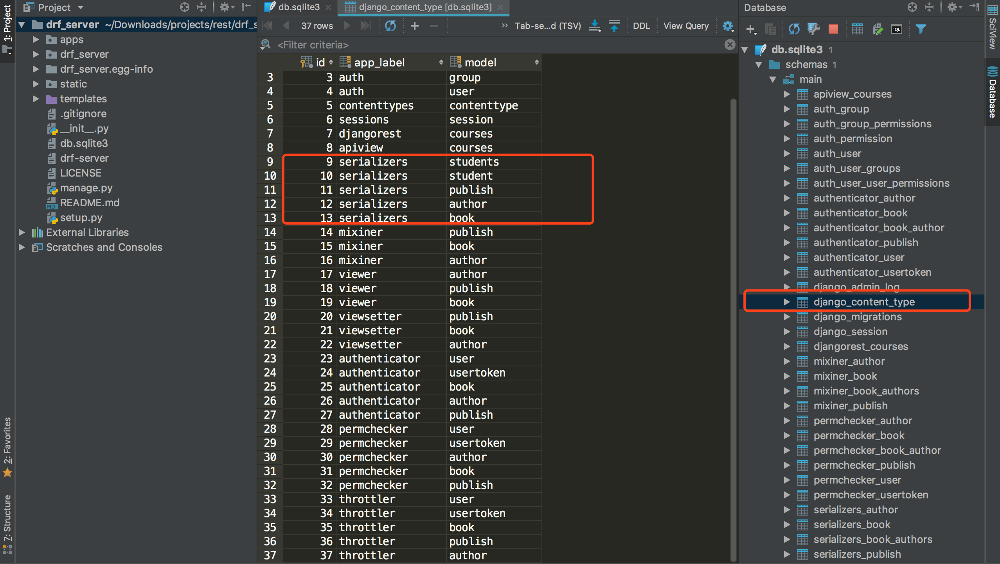
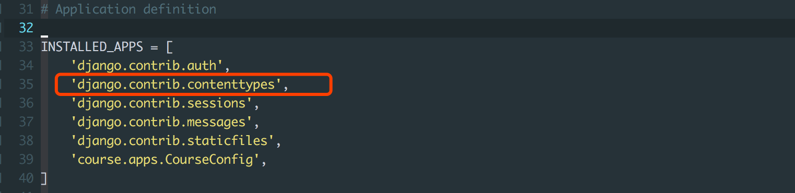
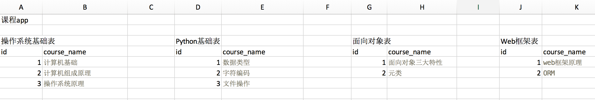
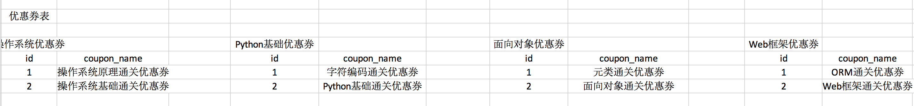
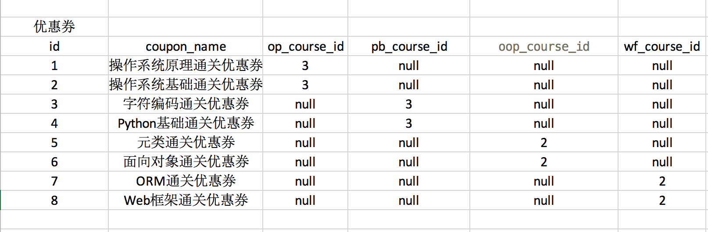
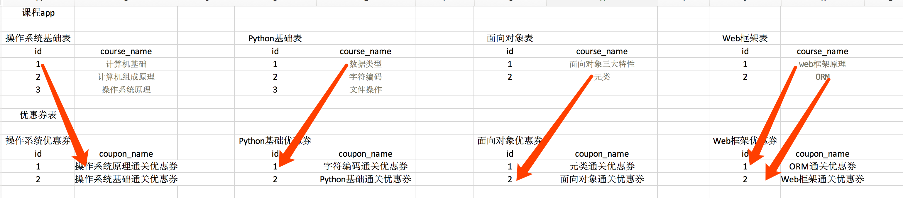
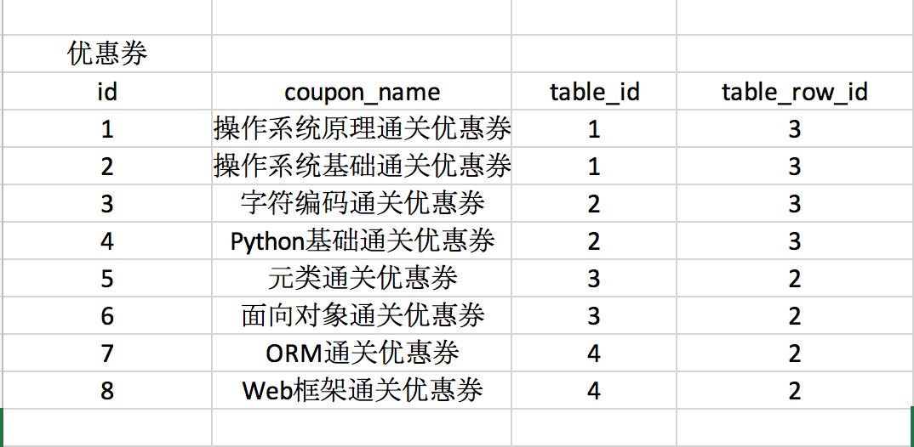
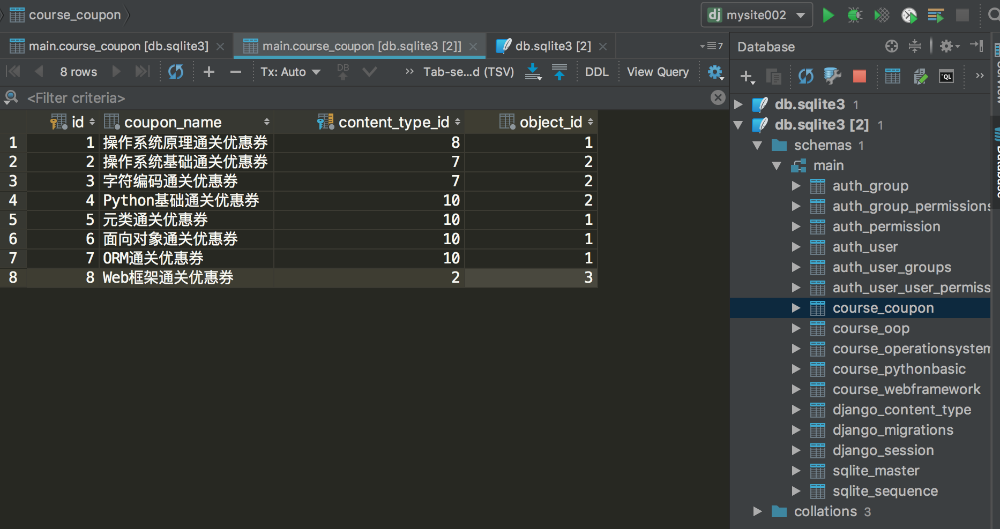
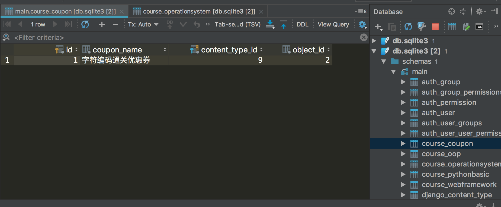
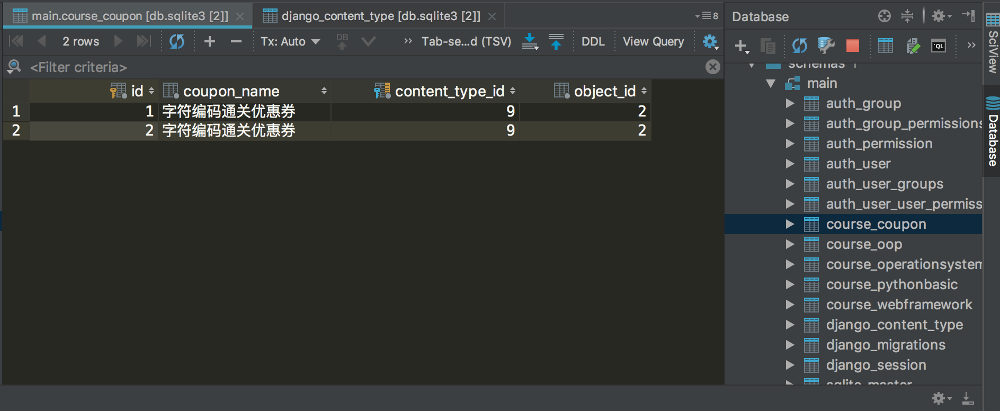

一切优化，最终都是关于需求的优化。本文介绍需求确定之后的数据库表结构设计优化。

<!--more-->

#### 引入

我们一直强调的一句话是，编程是数据结构和算法的结合。所谓数据就是用户需要访问和操作的资源，比如购物类App里面的商品，图书、衣服、鞋帽等等。算法就是我们通过一系列的获取数据、过滤数据、汇总并编排数据并最终展现给用户的一个过程。

算法的实现复杂度非常重要，因为它直接关乎到用户体验，用户体验的重要性，我们不需要再次强调了，算法实现简单则用户体验好，反正则用户体验差，而算法的实现复杂度直接与数据的存储结构相关，数据的存储结构如果设计的非常好，那么向用户展示数据的算法可能会非常简单，反之，则将异常复杂。

因此，数据结构或者说，数据库表结构的设计是至关重要的。

现在的应用程序，持久存储数据采用的是关系数据库，即Oracle，MySQL等等数据库软件，而用户需要的数据，则是存储到数据库表中，不同的人，设计出来的表结构不同，导致算法的实现过程会有非常明显的差别。

接下来，我们来学习，如果优化表结构。

#### 今日概要

- Django contenttypes框架

#### 知识点复习回顾

- 无

#### 今日详细

##### 概念

Django有一个用来跟踪所以已安装App的models的框架，名为contenttypes。本文标题**ContentType**其实是Django原生App之一**contenttypes**的实现基础。

该应用提供了一种高级的、通用的接口用来管理和维护我们应用程序的models。

拿我们之前的drf_server项目来举例，该框架会为每一个APP的models创建对应的信息，该信息存储在content_type表中，请看下图：



如上图所示，每一个App对应多个model, 存储在名为django_content_type的表中，该表只有*id*, *app_label*和*model*三个字段。第一个字段存储的是model的序号，下文中，contenttypes框架正是通过model的id找到该model，app_label存储的是App的名称，而model字段则存储的是每一个model的名称。

##### 安装使用

使用**django-admin startproject**命令创建一个Django项目后，在**INSTALLED_APPS**列表中会出现该框架，如下图所示：



##### 什么时候需要用到该框架

如果查看官方文档，你只会发现一些官方的对于该框架的解释，但是在什么地方能够发挥它的最大价值，官方文档中并没有详细说明，接下来，我们来设计一个需求，并根据这个需求的优化，来一步步学习contenttypes框架。

##### 一个简单的需求

假设现在我们需要开发一个课程App，该app共有如下课程表：



共四个课程表：*操作系统基础*，*Python基础*，*面向对象*，*Web框架*。

##### 需求

学生学完每个课程的最后一门课后，会获得该门课程的优惠券和该课程的总优惠券，比如学生学完*操作系统原理*课程后，会获得*操作系统原理通关优惠券*和*操作系统基础课程优惠券*两张优惠券。



##### 第一次优化

看到如此多的优惠券表，作为程序员，我们必须不能忍，要好好优化优化，不然，这就是给自己挖了一个巨大的坑，以后扩展和维护肯定会特别不方便。如何优化呢？

我们是否可以将如此多的优惠券表合成一张表呢？来看看。



这样我们就实现了使用一张优惠券表来存储所有的优惠券和对应的课程的关系信息（使用了课程id），注意每个课程id字典都是该优惠券表的一个外键字段。

##### 第二次优化

经过第一次优化，我们的表数量减少了，但是对这样的表进行增删改查操作将会非常麻烦，我之前就遇到过类似设计的表结构，当时一条SQL语句就是因为这个表而始终执行缓慢，后面经过优化，对这个表的增删改查操作速度有了非常明显的提升。

仔细想想，我们设计优惠券和课程之间的关系，无非就是为了增删改查这些操作，只要能够通过课程id找到它所对应的所有优惠券，或者通过优惠券能唯一定位到某一个具体的课程，这就是我们的本质需求。



现在的问题是，课程id是重复的，每一个表里面的id都是从1开始计数，而优惠券里面的id如果仅仅只是存储课程id，很显然，就无法帮助我们唯一定位到具体的课程。那么，通过什么方式来唯一定位id呢？

请看下图的优化：



看到了吗？我们使用的table_id和table_row_id来唯一定义某个课程表中的某一个课程，首先，我们必须通过某一个信息定位到具体的表，然后再通过课程id来定位具体的课程。

那么，table_id从哪里来呢？

还记得我们上面的django_content_type表吗？它里面有三个字段，其中id字段存储的就是整个Django项目中所有表的序号id。

所有我们的优惠券表共有四个字段，*id*字段，*coupon_name*字段存储优惠券信息，*table_id*字段存储的是课程表的id，它应该是一个外键，关联到*django_content_type*表，*table_row_id*字段，该字段的性质也是外键，但是不能具体指向某一个表，因为，该字段存储的是所有表的id。

优化到这里，差不多了，算是比较合适的表结构设计了。那么，我们应该怎么做呢？看起来还有点麻烦，特别是*table_row_id*字段。不是特别好实现。

##### 使用contenttypes建表

###### 导入

```python
from django.db import models
from django.contrib.contenttypes.models import ContentType
from django.contrib.contenttypes.fields import GenericForeignKey, GenericRelation
```

###### 建表

```python
class OperationSystem(models.Model):
    """
    id    course_name
    1     "计算机基础"
    2     "计算机组成原理"
    3     "操作系统原理"
    """
    course_name = models.CharField(max_length=32)
    coupons = GenericRelation(to="Coupon")

    def __str__(self):
        return self.course_name


class PythonBasic(models.Model):
    """
    id   course_name
    1    "数据类型"
    2    "字符编码"
    3    "文件操作"
    """
    course_name = models.CharField(max_length=32)
    coupons = GenericRelation(to="Coupon")

    def __str__(self):
        return self.course_name


class Oop(models.Model):
    """
    id   course_name
    1    "面向对象三大特性"
    2    "元类"
    """
    course_name = models.CharField(max_length=32)
    coupons = GenericRelation(to="Coupon")

    def __str__(self):
        return self.course_name


class WebFramework(models.Model):
    """
    id   course_name
    1    "web框架原理"
    2    "ORM"
    """
    course_name = models.CharField(max_length=32)
    coupons = GenericRelation(to="Coupon")

    def __str__(self):
        return self.course_name


class Coupon(models.Model):
    """
    id   name                 content_type_id    object_id
    1    "操作系统优惠券"            9                 2
    2    "Python 优惠券"            9                2
    """
    coupon_name = models.CharField(max_length=32)
    content_type = models.ForeignKey(ContentType, verbose_name="关联到django的ContentType表", on_delete=models.CASCADE)
    object_id = models.PositiveIntegerField(verbose_name="关联表中的数据行ID")
    content_object = GenericForeignKey("content_type", "object_id")

    def __str__(self):
        return self.coupon_name
```

小结一下，使用方式：

- 导入模块一个是ContentType这个model
- 另一个是GenericForeignKey和GenericRelation

优惠券表包含*coupon_name*, 该字段是一个外键，关联到ContentType表；

还包含*object_id*字段, 该字段存储课程id；

这两个字段的默认名称分别为*content_type*, *object_id*；

另外最重要的是content_object字段，它是GenericForeignKey这个类的实例化对象，我们创建这个对象时，需要把上面两个字段作为参数传递给它。

以后，我们对于优惠券表的所有数据操作，只要是涉及到需要查找优惠券对应的课程，或者通过课程查找其对应的优惠券，都是通过*content_object*来进行的。

值得注意的是，该字段并不真实存在表中，*Coupon*表结构如下图所示：



##### 基本数据操作

先插入一些基础数据，也就是第一张图中展示的数据。

###### 操作ContentType

上文提到，ContentType是一个表，这个表提供一些方法以便我们进行数据操作：

```python
>>> from django.contrib.contenttypes.models import ContentType

>>> course_type = ContentType.objects.get(app_label="course", model="oop")

>>> course_type
Out[7]: <ContentType: oop>

# 获取类名：字符串形式
>>> course_type.model
Out[8]: 'oop'

# 获取model，之后可以通过objects.all来查询数据
>>> course_type.model_class()
Out[9]: course.models.Oop

# 查询数据
>>> course_type.get_object_for_this_type(course_name="元类")
Out[10]: <Oop: 元类>

```

###### 添加数据

给课程**字符编码**添加一个**字符编码通关优惠券**：

```
>>> from course.models import PythonBasic

>>> pb_obj = PythonBasic.objects.get(id=2)

>>> from course.models import Coupon

>>> Coupon.objects.create(coupon_name="字符编码通关优惠券", content_object=pb_obj)
Out[15]: <Coupon: 字符编码通关优惠券>
```

查看数据是否添加成功：



可以看到，是第九张表的第二行数据，查看*django_content_type*表发现，该课程所在的表*Python基础表*，在整个项目中的确是第九张表，而且该课程在该表中是第二行数据，id为2。

这样，我们就可以通过表的id和数据id具体定位到某一个课程，然后给该课程绑定一个优惠券。当然还可以给它绑定多个优惠券。

```
>>> from course.models import Coupon
>>> from course.models import PythonBasic
>>> pb_obj = PythonBasic.objects.get(id=2)
>>> Coupon.objects.create(coupon_name="字符编码通关优惠券", content_object=pb_obj)
```



可以看到，我们定位具体的课程信息是通过content_object这个并不存在Coupon表中的字段来操作的。

###### 删除数据

删除*字符编码通关优惠券*对应的所有课程

```
>>> Coupon.objects.filter(coupon_name="字符编码通关优惠券").delete()
```

或者

```
>>> pb_obj = PythonBasic.objects.get(id=2)
>>> ob_obj.coupons.all().delete()
```

###### 修改数据

略......

###### 查询数据

查询*面向对象通关优惠券*绑定了那些课程

```
>>> coupon_obj = Coupon.objects.filter(coupon_name="面向对象通关优惠券").first()
>>> coupon_obj.content_type # <PythonBasic: 字符编码>
```

使用反向查询字段查看*字符编码*课程共有哪些优惠券

```
>>> pb_obj = PythonBasic.objects.get(id=2)
>>> pb_obj.coupons.all()
Out[35]: <QuerySet [<Coupon: 字符编码通关优惠券>, <Coupon: 面向对象通关优惠券>]>
```

#### 今日总结

综上，我们会发现，在我们的项目里面，如果一个表跟其他多个表都有外键关系，而且外键都在该表上，那么我们可以使用contenttypes框架来帮助我们管理这些外键关系，本质上，contenttypes的实现基于ContentType这张表，而且，除字段名不一样外，通过该框架设计的表与我们自己优化出来的表结构是一致的。

- Django contenttypes框架介绍
- 通过contenttypes对数据库表结构进行优化
- 通过contenttypes进行增删改查操作

#### 作业

作业：请将本节课所讲的知识点总结并练习一遍。