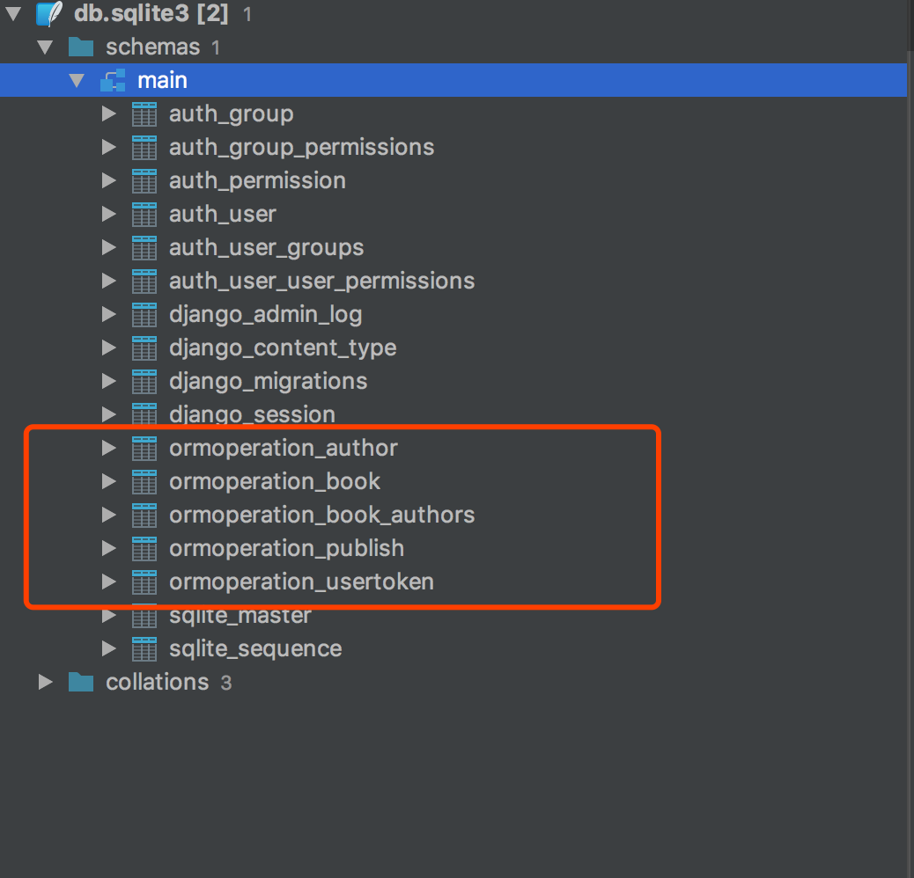

所谓编程，本质上，其实就是获取数据源，通过特定的算法，最后，输出我们最终想要的数据。官方一点的说法，编程即数据结构和算法的结合，本文详细介绍了Django ORM操作数据库的方式。

<!--more-->

#### 普通数据库操作

在开始介绍ORM之前，我们先来回顾一下使用传统方式操作数据，之后再用ORM来操作数据库。

##### 创建项目djangorm

```
>>> django-admin startproject djangorm
```

##### 生成sqlite3文件

```
# 此命令并非连接数据库的命令，不过如果使用sqlite3，需要使用此命令来创建一个sqlite3数据库文件
>>> python manage.py makemigrations
```

##### 创建数据表

我们使用Django自带的sqlite3来存储数据，首先创建几张数据库表，分别是作者表、书籍表、出版社表，并插入数据，完成之后的数据库结构如下：

###### Author表

```
# 建表
CREATE TABLE author
(
    nid int PRIMARY KEY AUTOINCREMENT NOT NULL,
    name varchar(32),
    age int,
    email varchar(32)
);

# 插入数据
INSERT INTO "author" ("nid", "name", "age", "email") VALUES (1, 'alex', 18, 'alex@oldboy.com')
INSERT INTO "author" ("nid", "name", "age", "email") VALUES (2, 'egon', 19, 'egon@oldboy.com')
INSERT INTO "author" ("nid", "name", "age", "email") VALUES (3, 'oldboy', 20, 'oldboy@oldboy.com')
INSERT INTO "author" ("nid", "name", "age", "email") VALUES (4, 'peiqi', 21, 'peiqi@oldboy.com')
INSERT INTO "author" ("nid", "name", "age", "email") VALUES (5, 'yuanhao', 22, 'yuanhao@oldboy.com')
INSERT INTO "author" ("nid", "name", "age", "email") VALUES (6, 'baoyuan', 23, 'baoyuan@oldboy.com')
INSERT INTO "author" ("nid", "name", "age", "email") VALUES (7, 'wuchao', 24, 'wuchao@oldboy.com')
INSERT INTO "author" ("nid", "name", "age", "email") VALUES (8, 'pizza', 17, 'pizza@oldboy.com')
```

###### Book表

该表的publish_id字段关联到publish表的nid字段

```
# 建表
CREATE TABLE book57c6
(
    nid int PRIMARY KEY AUTOINCREMENT,
    title varchar(32) NOT NULL,
    price decimal(5,2) NOT NULL,
    publish_date int NOT NULL
);

# 插入数据
INSERT INTO "book" ("nid", "title", "price", "publish_date") VALUES (1, 'Python入门', 119.00, 1514764800000)
INSERT INTO "book" ("nid", "title", "price", "publish_date") VALUES (2, 'Python进阶', 128.00, 1528780823692)
INSERT INTO "book" ("nid", "title", "price", "publish_date") VALUES (3, 'Python高级编程', 169.00, 1530163256294)
INSERT INTO "book" ("nid", "title", "price", "publish_date") VALUES (4, 'Linux入门', 55.00, 1534569663151)
INSERT INTO "book" ("nid", "title", "price", "publish_date") VALUES (5, 'Linux进阶', 66.00, 1540099268791)
INSERT INTO "book" ("nid", "title", "price", "publish_date") VALUES (6, 'Linux高级', 77.00, 1527571277772)
INSERT INTO "book" ("nid", "title", "price", "publish_date") VALUES (7, 'Go入门', 109.00, 1529126485754)
```

###### Publish表

```
# 创建表
CREATE TABLE publish
(
    nid int PRIMARY KEY AUTOINCREMENT NOT NULL,
    name varchar(32) NOT NULL,
    city varchar(32) NOT NULL,
    email varchar(32) NOT NULL
);

# 插入数据
INSERT INTO "publish" ("nid", "name", "city", "email") VALUES (1, '清华大学出版社', '北京市', 'tingshua@example.com')
INSERT INTO "publish" ("nid", "name", "city", "email") VALUES (2, '浙江大学出版社', '杭州市', 'zheda@example.com')
INSERT INTO "publish" ("nid", "name", "city", "email") VALUES (3, '武汉大学出版社', '武汉市', 'wuda@example.com')
INSERT INTO "publish" ("nid", "name", "city", "email") VALUES (4, '复旦大学出版社', '上海市', 'fuda@example.com')
```

###### book2author

另外因为作者和书籍之间是多对多关系，所以还需要一张多对多关系表book2author

```
# 创建表
CREATE TABLE book2author
(
    nid int PRIMARY KEY AUTOINCREMENT NOT NULL,
    book_id int NOT NULL,
    author_id int NOT NULL
);

# 插入数据
INSERT INTO "book2author" ("nid", "book_id", "author_id") VALUES (1, 2, 1)
INSERT INTO "book2author" ("nid", "book_id", "author_id") VALUES (2, 2, 2)
INSERT INTO "book2author" ("nid", "book_id", "author_id") VALUES (3, 2, 3)
INSERT INTO "book2author" ("nid", "book_id", "author_id") VALUES (4, 2, 4)
INSERT INTO "book2author" ("nid", "book_id", "author_id") VALUES (5, 3, 3)
INSERT INTO "book2author" ("nid", "book_id", "author_id") VALUES (6, 3, 4)
INSERT INTO "book2author" ("nid", "book_id", "author_id") VALUES (7, 4, 1)
INSERT INTO "book2author" ("nid", "book_id", "author_id") VALUES (8, 4, 5)
INSERT INTO "book2author" ("nid", "book_id", "author_id") VALUES (9, 5, 2)
INSERT INTO "book2author" ("nid", "book_id", "author_id") VALUES (10, 5, 3)
INSERT INTO "book2author" ("nid", "book_id", "author_id") VALUES (11, 6, 4)
INSERT INTO "book2author" ("nid", "book_id", "author_id") VALUES (12, 7, 3)
INSERT INTO "book2author" ("nid", "book_id", "author_id") VALUES (13, 7, 5)
INSERT INTO "book2author" ("nid", "book_id", "author_id") VALUES (14, 1, 1)
INSERT INTO "book2author" ("nid", "book_id", "author_id") VALUES (15, 1, 4)
```

准备完毕。

##### 创建App

创建一个名为classicoperation的App

```
>>> python manage.py startapp classicoperation
```

##### 修改settings配置

接下来我们需要修改settings和url等等配置，以便Django能够找到我们的网页模板以及能将不同的url请求分发给不同的视图函数处理。

###### 修改settings中的templates配置

```
TEMPLATES = [
    {
        'BACKEND': 'django.template.backends.django.DjangoTemplates',
        # 添加一个新的目录
        'DIRS': [os.path.join(BASE_DIR, 'templates')],
        'APP_DIRS': True,
        'OPTIONS': {
            'context_processors': [
                'django.template.context_processors.debug',
                'django.template.context_processors.request',
                'django.contrib.auth.context_processors.auth',
                'django.contrib.messages.context_processors.messages',
            ],
        },
    },
]
```

###### 项目urls.py

```
from django.conf.urls import include
from django.urls import re_path

urlpatterns = [
    re_path(r'^classicoperation/', include('classicoperationviews.urls')),
]
```

###### 程序urls.py

```
from django.urls import re_path
from classicoperation import views

urlpatterns = [
    re_path(r'^index/$', views.index),
    re_path(r'^login/$', views.login),
    re_path(r'^authors/$', views.authors),
]
```

##### 三个视图函数

view.py中的代码如下：

```
from django.shortcuts import render
from django.http import JsonResponse

import sqlite3
# Create your views here.


def index(request):
    return render(request, 'classicoperation/index.html')


def authors(request):
    if request.method == 'GET':
        sqlite = sqlite3.connect("/Users/pizza/Downloads/projects/python/djangorm/db.sqlite3")
        cursor = sqlite.cursor()
        sql = 'select * from author;'
        cursor.execute(sql)
        ret = cursor.fetchall()
        cursor.close()
        sqlite.close()
        return JsonResponse(ret, safe=False)


def login(request):
    if request.method == 'GET':
        return render(request, 'classicoperation/login.html')
    elif request.method == 'POST':
        try:
            username = request.POST.get('name')
            age = request.POST.get('age')
            email = request.POST.get('email')
            print(username, age, email)
            sqlite = sqlite3.connect("/Users/pizza/Downloads/projects/python/djangorm/db.sqlite3")
            cursor = sqlite.cursor()
            sql = 'INSERT INTO "author" ("nid", "name", "age", "email") VALUES (9, \"{username}\", \"{age}\", \"{email}\")'
            sql = sql.format(username=username, age=age, email=email)
            print(sql)
            cursor.execute(sql)
            sqlite.commit()
            cursor.close()
            sqlite.close()
            user_info = {
                'username': username,
                'age': age,
                'email': email
            }
            return JsonResponse(user_info, safe=False)
        except Exception as e:
            return JsonResponse(str(e), safe=False)
```

login.html中的代码如下：

```
<!DOCTYPE html>
<html lang="en">
<head>
  <meta charset="UTF-8">
  <title>Title</title>
</head>
<body>
  <form action="" method="POST" enctype="application/x-www-form-urlencoded">
    
    <p>请输入用户名：<input type="text" name="name"/></p>
    <p>请输入年龄：<input type="text" name="age"/></p>
    <p>请输入邮箱：<input type="text" name="email"/></p>
    <p>提交：<input type="submit" value="提交"/></p>
  </form>

</body>
</html>
```

以上代码有如下几点问题：

- 将业务代码和数据库操作融合到了一起，耦合性很高不方便日后维护和扩展以及测试
- 一旦数据库迁移到其它类型的数据库中，那么所有涉及到的数据操作都需要重新修改
- 大量的原生SQL语句操作，对于开发来说，学习成本很大

我们可以将数据操作解耦到一个独立的文件中，来解决第一个问题，不过第二点和第三点没有更好的解决方式。

如果我们能通过Python代码来操作数据库，再假设有一个引擎，能够将我们写的Python代码翻译成SQL语句，那么不管是什么类型的数据库，不管日后如何迁移，所有的翻译工作都交给引擎来做，而上层的数据库操作代码不需要修改，那就能够解决第二个问题。

而且，就不会有第三个问题了。


#### ORM操作数据库

##### 什么是ORM？

接下来，我们该聊聊ORM了。ORM是对象关系映射**Object Relational Mapping**的简写。它并不是Django独创的，Java语言也有类似的工具。

ORM就是我们上述提到的引擎。

Django的orm操作本质上会根据所配置的数据库引擎，翻译成对应的sql语句；所有使用Django开发的项目无需关心程序底层使用的是MySQL、Oracle、sqlite....，如果数据库迁移，只需要更换Django的数据库引擎即可；

##### 为什么使用ORM？

正是因为上述三个问题，我们才需要使用ORM，但是ORM绝不是万能的，ORM能够解决绝大部分关于数据库处理的要求，但是某些复杂的查询操作，ORM翻译出来的SQL语句性能并不一定高，所以此时使用原生SQL语句可能会更加高效一些。

##### 什么时候使用ORM？

目前Django自带了ORM，如果使用Django进行web app开发，可以使用Django的ORM，它能处理绝大部分需求。

如果使用flask进行web app开发，可以使用sqlalchemy这个第三方的ORM框架，它使用广泛而且功能强大。

##### 如何使用ORM？

接下来，我们就正式进入ORM的学习。本文采用的是Django自带的ORM框架。版本是django2.0，参考文档是官方文档最新版(2.1)。

###### Django ORM的翻译规则

首先我们介绍ORM的翻译规则，它将数据库中的表翻译成一个Python类，表中的字段翻译成该类中的类变量，每一个行数据就是这个类的一个个实例对象。

```
类名对应 ------>数据库中的表名

类变量对应------>数据库里的字段

类实例对应------>数据库表里的一行数据
```

###### 新建App

我们继续使用sqlite3，不过，需要新建一个app

```
>>> python manage.py startapp ormoperation
```

###### 配置urls.py

项目urls.py

```
from django.conf.urls import include
from django.urls import re_path

urlpatterns = [
    re_path(r'^classicoperation/', include('classicoperationviews.urls')),
    re_path(r'^ormoperation/', include('ormoperation.urls')),
]
```

###### 创建model

接下来，我们需要在app中的model.py文件中，创建我们的翻译关系，也就是类、类变量，而类实例则是通过orm来操作的。

我们创建刚刚的几张表对应的类，如下代码所示：

```
from django.db import models

# Create your models here.


# Author表
class Author(models.Model):
    nid = models.AutoField(primary_key=True)
    name = models.CharField(max_length=32)
    age = models.IntegerField()
    email = models.EmailField()


# UserToken表
class UserToken(models.Model):
    user = models.OneToOneField(to="Author", on_delete=models.CASCADE)
    token = models.CharField(max_length=128)


# Publish表
class Publish(models.Model):
    nid = models.AutoField(primary_key=True)
    name = models.CharField(max_length=32)
    city = models.CharField(max_length=32)
    email = models.EmailField()


# Book表
class Book(models.Model):
    nid = models.AutoField(primary_key=True)
    title = models.CharField(max_length=32)
    price = models.DecimalField(max_digits=5, decimal_places=2)
    publish_date = models.DateField()
    publish = models.ForeignKey(to="Publish", to_field="nid", on_delete=models.CASCADE)
    authors = models.ManyToManyField(to="Author")
```

- 每个model类都是django.db.models.Model的子类，必须继承models.Model
- 每一个model类的属性代表了一个数据表字段
- 按照以上方式创建完成之后，Django提供了一系列的API，方便我们对数据库进行操作

###### 注册App

并且必须将该App注册进settings里面的INSTALLED_APPS中

```
INSTALLED_APPS = [
    ...
    'ormoperation.apps.OrmoperationConfig',
]
```

###### 同步数据库

然后，执行如下两条命令，就会在数据库中创建对应的表:

python manage.py makemigrations

```
Migrations for 'ormoperation':
  ormoperation/migrations/0001_initial.py
    - Create model Author
    - Create model Book
    - Create model Publish
    - Create model UserToken
    - Add field publish to book
```

python manage.py migrate

```
Operations to perform:
  Apply all migrations: admin, auth, contenttypes, ormoperation, sessions
Running migrations:
  Applying contenttypes.0001_initial... OK
  Applying auth.0001_initial... OK
  Applying admin.0001_initial... OK
  Applying admin.0002_logentry_remove_auto_add... OK
  Applying contenttypes.0002_remove_content_type_name... OK
  Applying auth.0002_alter_permission_name_max_length... OK
  Applying auth.0003_alter_user_email_max_length... OK
  Applying auth.0004_alter_user_username_opts... OK
  Applying auth.0005_alter_user_last_login_null... OK
  Applying auth.0006_require_contenttypes_0002... OK
  Applying auth.0007_alter_validators_add_error_messages... OK
  Applying auth.0008_alter_user_username_max_length... OK
  Applying auth.0009_alter_user_last_name_max_length... OK
  Applying ormoperation.0001_initial... OK
  Applying sessions.0001_initial... OK
```

数据库中会出现如下几张表：



红框部分就是我们创建的表：

- 注意表名前面会自动由django帮我们带上当前app的名称（可自定义）。其中作者与书籍之间的关系表，由ORM帮助我们创建完成，当然，我们也可以自己创建。
- 如果我们没有指定主键字段，django orm会自动帮我们创建一个名为id的主键字段
- 创建表的语句默认使用PostgreSQL，当然，也可以自定义，需要修改settings中的DATABASES变量

- 其他的表是Django内部表。

此时在app的migrations包下面会出现一个0001_initial.py的文件。


#### 字段类型介绍

model类中最重要也是唯一必须要有的部分，就是数据库字段。model中的每一个字段都是一个合适的Field类的实例对象。Django通过不同的Filed类来定义不同的字段类型，告诉数据库用户存储的是什么类型的数据（比如：INTEGER， VARCHAR， TEXT）。

在上文中，我们提到，类中每一个变量对应数据库表中的每一个字段，我们知道，在数据库中，字段有字段类型，来存储不同类型的数据，比如char，varchar，integer等等，orm本质上只是一个翻译官，数据库中的字段类型，在orm中，都有对应关系，接下来，我们就来一一介绍这些字段类型在orm中的表示方式。

##### 字段参数

介绍字段之前，我们先介绍所有字段类都能够使用字段参数。当然，他们都是可选参数。

###### null

如果该参数的值为True，比如name = models.CharField(null=True)，Django会存储空值到数据库中。该参数的默认值为False。

请尽量避免在字符串类型的字段使用此参数，比如CharFiled和TextField。如果一个字符串类型的字段包含null=True参数，意味着该字段有两种可能值：NULL和空字符串，按照惯例，Django会存储空字符串。

不过，如果CharField有unique=True和blank=True参数，在这种情况下，建议使用null=True来防止唯一约束报错。

###### blank

如果值为True，该字段允许为空。但是该参数与null不同，null是纯数据库相关的参数，用来表示数据库中是否存储空值，而blank参数是用来做验证的，如果值为False，那么该字段必须被填入非空值。否则，可以为空。

###### choices

一个可迭代对象，它是一个嵌套的数据结构，外层可以是元组或者列表，里面的每一个元素是可选值（比如[(A, B), (A, B)]。

元组的第一个元素是存储在数据库中的真实的值， 而第二个元素是方便程序员阅读的数据，比如：

user_type = [(1, "DELUX"), (2, "SVIP"), (3, "VVIP")], 该数据建议存储在model类中。

###### db_column

数据库中的字段名称，如果为True，Django会使用该字段名。

###### db_index

如果为True，数据库会为该字段创建一个索引。

###### db_tablespace

为字段索引指定索引表空间（如果数据库支持）。

###### default

字段默认值，可以是一个值也可以是一个可调用对象。不能是一个可变对象，比如dict，必须使用调用对象返回字典的方式替代。

###### primary_key

如果为True，该字段为主键字段。

###### unique

如果为True，该字段的值必须唯一。如果值不唯一，那么调用save()方法的时候，会触发一个IntegrityError错误。

###### related_name

用来定义反向查询时所使用的model名称。如果没有related_query_name则可以使用它进行字段查询。

###### related_query_name

用来定义反向查询时所使用的字段名称。

###### verbose_name

为方便程序员阅读的参数。比如：name = models.CharField(verbose_name="用户名")。

此外，还有更多的字段参数，请参考[官方文档](https://docs.djangoproject.com/en/2.1/ref/models/fields/#field-options)。

##### 字段类型

###### AutoField

自增字段，存储的是integer类型，如果不指定该类型的字段，Django会默认帮助我们创建一个AutoField字段

###### BigAutoField

同为自增字段，与AutoField字段类型，最小值为1，最大为9223372036854775807

###### BigIntegerField

大整数字段

A 64-bit integer, much like an IntegerField except that it is guaranteed to fit numbers from -9223372036854775808 to 9223372036854775807. The default form widget for this field is a TextInput。

###### BinaryField

二进制字段，用来存储二进制数据，该字段有一个额外参数max_length，表示支持最大的数据长度。

###### BooleanField

真假值True或者Flase字段

###### CharField

字符串字段，用来存储字符串，该字段有一个额外参数max_length, 表示支持最大的数据长度。在数据库中，该字段被翻译为varchar类型。如果需要使用char，需要自定义字段类型。

###### DateField

日期字段，用Python中的datetime.date来实现，有几个额外的参数可用。

auto_now, 如果为True, 每次对象的save方法被调用时，字段的值被更新为当前日期。当其他字段使用QuerySet.update()时，该字段不被更新。

auto_now_add, 如果为True, 自动设置该字段的值当前时间，不过只有在数据被创建时。

###### DateTimeField

日期和时间字段，使用Python中的datetime.datetime来实现，该字段与DateField有相同的额外参数。

###### DecimalField

十进制小数字段，用来控制精度。用Python中的Decimal来实现。该字段有两个必须参数。

max_digits, 最大长度，包含整数和小数部分；

decimal_places, 小数部分长度。假设要存储的数据最大为999，小数部分有两位，则应该是：

price = models.DecimalField(max_digits=5, decimal_places=2)

###### EmailField

邮箱字段，不是本质上字符串类型CharField，该Field类用来验证数据是否是合法的邮箱格式。

###### IntegerField

整型字段

###### Foreignkey

关系字段，代表多对一关系。该字段需要两个位置参数，分别是to和on_delete。

to, 该字段关联到哪张表；

on_delete，稍后介绍。

我们可以通过将to指定为当前表，来创建递归关系。该字段上面会默认创建索引，也可以通过db_index参数禁用索引的创建操作。

当主表的数据被删除时，Django会模拟数据库中的行为，通过on_delete参数，该参数有如下几个可选值：

- models.CASCADE，级联删除，主表（被关联表）数据被删除，从表（关联表）数据也被删除；

- models.PROTECT, 当主表数据被删除时, 保护从表数据不被删除；

- models.SET_NULL，当主表数据被删除时, 将从表数据设置为空；

- models.SET_DEFAULT，当主表数据被删除时, 将从表数据设置为默认值；

- models.SET(), 当主表数据被删除时, 将从表数据设置为SET(get_value)的执行结果;

- models.DO_NOTHING, 当主表数据被删除时, Take no action。

to_field, 关联到主表的哪个字段，默认会关联到主键字段，如果你需要指定其他字段，那个字段必须包含unique=True。

###### ManyToManyField

多对多关系字段。需要一个位置参数：to，指向关系表。与ForeignKey字段类型的工作机制完全一样。

Django通过创建一张中间表，来存储两张表之间的多对多关系，我们可以通过db_table参数来指定表名；

如果需要手动创建关系表，可以通过through参数，该参数的值为关系表名；

更多参数介绍，请参考[这篇文章](https://docs.djangoproject.com/en/2.1/ref/models/fields/#manytomanyfield)。

###### OneToOneField

类似多对一字段ForeignKey(unique=True)，与ForeignKey字段类型的工作机制完全一样。

更多关于字段类型和参数的介绍，请参考[官方文档](https://docs.djangoproject.com/en/2.1/ref/models/fields/#module-django.db.models.fields)。


#### 通过ORM进行数据增删改查

当model创建完成之后，我们就可以利用Django提供给我们的大量的方便的API来操作数据了，比如增、删、改、查，接下来我们这些API，下文中用到的操作环境是Django的shell环境，使用如下命令进入：

```
python manage.py shell
```

##### 新增数据

###### 单表新增数据

因为所有操作都会涉及到单表和联表操作，所以，我们会分别介绍单表和联表的操作方式。

在上文中介绍过，每一个model类的实例化对象代表一行数据，因此，新增数据就是实例化一个新的model对象，并使用该对象的save()方法将数据保存进数据库：

方式一：类实例化

```
>>> from ormoperation import models
>>> user = models.Author(name="John", age=19, email="John@example.com")
>>> user.save()
```

方式二：models.表.objects.create()

```
>>> from ormoperation import models
>>> user = models.Author.objects.create(name="alex", age=20, email="alex@example.com")
```

###### ForeignKey新增数据

方式一：models.表.objects.create()

```
>>> from ormoperation import models
>>> models.Book.objects.create(title="Go高级编程", price=99, publish_date="2018-11-08", publish_id=1)
>>> <Book: Book object (8)>
```

方式二：对象方式

```
>>> from ormoperation import models
# 获取出版社对象
>>> pub_obj = models.Publish.objects.get(pk=1)
# 注意是publish=pub_obj
>>> book_obj = models.Book(title="Java入门", price="120", publish_date="2018-11-09", publish=pub_obj)
>>> book_obj.save()
```

###### ManyToManyField

如果是多对多关系，就只能使用类实例化的方式来新增数据：

```
>>> from ormoperation import models
# 先找到要绑定关系的book对象
>>> book_obj = models.Book.objects.get(pk=7)
# 再找到author对象，可以是一个，也可以是多个
>>> author_obj_john = models.Author.objects.get(pk=11)
>>> author_obj_alex = models.Author.objects.get(pk=12)
# 最后通过book对象的authors(authors是ManyToManyField字段)的add方法添加数据
>>> book_obj.authors.add(author_obj_john, author_obj_alex)
```

##### 查询数据

通过ORM从数据库中获取数据，需要创建一个QuerySet。

QuerySet是数据对象的集合，即，一个个model类的对象集合。集合中可以有0个、1个或者多个*filters*。如果在创建QuerySet的时候不给定任何参数，那么Filters包含了所有的字段，否则，Filters可以精细化字段个数。与SQL语句相比，QuerySet等同于一条SQL语句，即，创建一个QuerySet就是在写一条SQL语句，filter则相当于*where*或者*limit*子句。

###### 查询所有数据

```
>>> authors = models.Author.objects.all()

>>> print(authors)
>>> <QuerySet [<Author: Author object (1)>, <Author: Author object (2)>, <Author: Author object (3)>, <Author: Author object (4)>, <Author: Author object (5)>, <Author: Author object (6)>, <Author: Author object (7)>, <Author: Author object (8)>, <Author: Author object (9)>, <Author: Author object (11)>, <Author: Author object (12)>]>
```

###### 查询特定数据

通常情况下，我们并不需要查询出所有的数据，只需要得到一部分数据即可。

为了得到QuerySet的子集，我们需要精细化SQL语句，也就是QuerySet，比如增加过滤条件，最常用的两种方式是使用*filter*和*exclude*。

###### filter

*filter*会返回一个符合过滤条件的新的QuerySet。

###### exclude

*exclude*返回一个不满足过滤条件的新的queryset。

比如，我要查询姓名为alex的作者数据，QuerySet如下：

```
>>> models.Author.objects.filter(name="alex")
```

上面的QuerySet等价于下面的形式：

```
>>> models.Author.objects.all.filter(name="alex")
```

###### 链式filters

我们可以对filter的返回结果继续使用filter或者exclude，因为它的返回结果也是QuerySet。比如：

```
>>>models.Author.objects.filter(name="alex").exclude(publish_date=datetime.date.today).filter(age=18)
```

###### QuerySet是惰性的

实际上，创建QuerySet时，数据库是不会执行SQL语句的。只有在QuerySet被计算时，SQL语句才真正执行。比如：

```
>>> q = models.Author.objects.filter(name="alex")
>>> q = exclude(publish_date=datetime.date.today)
>>> q = filter(age=18)
>>> print(q)
```

看起来，上述三个QuerySet执行了三条SQL语句，但是实际上并非如此，只有最后的**print**语句才会触发SQL语句执行。

###### get()方法获取单个对象

**filter()**返回的是一个QuerySet，即使只有一行数据符合过滤要求，filter的返回值也是一个QuerySet。从而可以继续对其进行QuerySet支持的操作。

如果你明确知道过滤后的数据只有一行，那么你可以使用get()方法。比如：

```
>>> models.Book.objects.get(pk=1)
```

注意：当我们使用get()和filter()[0]时，他们之间有一些差别，如果没有匹配到数据，那么get()方法会抛出一个*DoseNotExist*的异常。同样的，如果get()返回多个数据，也会抛出一个*MultipleObjectsReturned*的异常。

###### 切片限制QuerySet的大小

我们可以通过Python列表的切片语法，来限制查询结果集的大小：

```
>>> models.Author.objects.all()[0:5]
```

注意，不支持负整数切片。切片获取数据同样不会触发SQL语句在数据库中执行，但是如果切片包含步长，则会触发SQL语句执行。另外，切片后返回的QuerySet不支持继续使用filter进行过滤。

###### Field lookups

*Field lookups*指的是如何指定**where**子句。它们作为关键字参数传递给QuerySet的filter(), exclude(), get()方法。

基本的查找格式是**field__lookuptype=value**, 注意双下划线。比如：

```
>>> models.Books.filter(publish_date__lte="2018-01-01")
```

上述QuerySet会被翻译为如下SQL语句：

```
SELECT * FROM app_book where publish_date <= "2018-01-01";
```

###### 常用的lookups

**exact**

写法如下：

```
>>> models.Book.get(title__exact="Go入门")
```

对应的SQL语句如下：

```
SELECT * FROM app_book WHERE title = "Go入门";
```

下面两个QuerySet是等价的：

```
>>> models.Book.objects.get(nid__exact=1)   # 手动方式
>>> models.Book.objects.get(id=14)          # 隐式转为 id__exact=1
```

另外还有*iexact*，它会忽略大小写。

**contains**

写法如下：

```
>>> models.Book.objects.get(title__contains="Alex")
```

对应的SQL语句如下：

```
SELECT * FROM app_book WHERE title LIKE '%Lennon%';
```

**in**

写法一：

```
>>> models.Book.objects.filter(pk__in=[1, 2])
```

写法二：

```
>>> publish_obj = models.Publish.objects.filter(pk__in=[1, 2])
>>> models.Book.objects.filter(publish__in=publish_obj)
```

另外还有**gt**,**gte**, **lt**,**lte**,**startswith**,**istartswith**,**endswith**，更多详细介绍请参考[官方文档](https://docs.djangoproject.com/en/2.1/ref/models/querysets/#field-lookups)。

###### 双下划线关系查询

Django提供了强大且直观的方式用来进行关系查询，自动帮你进行join操作。直接使用关系字段名称即可，然后通过双下划线与主表（被关联表）的字段进行连接查询，下面的查询语句过滤出出版社为清华大学出版社的书籍，QuerySet如下：

```
>>> models.Book.objects.filter(publish__name="清华大学出版社")
```

注意双下划线关系查询虽然可以用于多对多字段，但是只能使用关联字段，如果使用其他字段会报错，比如下面的方法第一个正确而第二个会报错：

```
>>> models.Book.objects.filter(authors__nid=1)      # 正确
>>> models.Book.objects.filter(authors__book_id=1)  # 报错
```

或者

```shell
>>> book_obj = models.Book.objects.get(id=1)
>>> book_obj.authors.filter()
```

###### 反向查询

反向查询方式一：小写的从表名+双下划线+字段名，比如 book__title="Python"

而反向查询使用小写的从表（关联表）名加上双下划线和字段名称即可，下面的查询语句过滤出出版过Python开头的书籍的出版社：

```
>>> models.Publish.objects.filter(book__title__contains="Python")
```

反向查询也可以用于多对多字段，但是只能使用关联字段，不能使用关联字段外的其他字段，比如Book和Author表的关联字段是nid，所以只能使用nid，而不能使用其他字段，否则报错：

```
>>> models.Book.objects.filter(authors__nid=1)
or
>>> models.Author.objects.filter(book__nid=1)
```

反向查询方式二:  使用related_name定义的名称，假设related_name="books",  则可以写为books__title, 代码如下：

```
>>> models.Publish.objects.filter(books__title="Python")
```

或者直接对QuerySet进行过滤：

```
>>> Publish.objects.get(pk=3).books.all()
```

**注意**：当只有related_name时，该参数指定的值可以进行类似model查找，比如：

```
>>> Publish.objects.get(pk=3).books.all()
```

也可以进行跨字段查找，比如：

```
>>> Publish.objects.filter(books__title="python")
```

**注意**：当同时存在related_name和related_query_name时，只能使用related_name进行跨model查找，而related_query_name只能进行字段查找。

反向查询方式三：

如果没有related_name，我们可以使用book_set的方式，book在此处代表从表（被关联表）的表名，必须是全小写形式，请注意，book_set方法属于每一个对象，QuerySet没有该方法：

```
>>> Publish.objects.get(pk=1).book_set.all()
```

###### F对象

至此，我们在filter所使用的都是对字段与常量进行对比。

如果需要与当前model中的其他字段进行对比呢？如何做？Django提供了F对象，如下：

```
>>> from django.db.models import F
>>> models.Book.objects.filter(price__gt=F('price'))
```

F对象支持表达式：

```
>>> from django.db.models import F
>>> models.Book.objects.filter(price__gt=F('price') * 2)
# 或者
>>> from django.db.models import F
>>> models.Book.objects.filter(price__gt=F('price') + F('price'))
```

###### Q对象

 Q（）可以使orm的fifter（）方法支持， 多个查询条件，使用逻辑关系（&、|、~）包含、组合到一起进行多条件查询；

**语法：**

fifter（Q（查询条件1）| Q（查询条件2））

fifter（Q（查询条件2）& Q（查询条件3））

fifter（Q（查询条件4）& ~Q（查询条件5））

fifter（Q（查询条件6）| Q（Q（查询条件4）& ~ Q（Q（查询条件5）& Q（查询条件3）））包含

下面的QuerySet查询从title为Python入门或者Python进阶的书籍对象：

```
>>> from django.db.models import Q
>>> models.Book.objects.filter(Q(title__exact="Python入门")|Q(title__exact="Python进阶"))
```

注意：非Q查询条件一定要包含在Q查询条件的后面。

###### 主键查找

Django提供一种简单的查找，pk查找，即主键查找。

写法如下：

```
>>> models.Book.objects.get(nid__exact=1)
>>> models.Book.objects.get(nid=1)
>>> models.Book.objects.get(pk=1)     # implies nid__exact
```

主键查找也支持联表查询，写法如下：

```
>>> models.Book.objects.filter(publish__nid__exact=1)
>>> models.Book.objects.filter(publish__nid=1)
>>> models.Book.objects.filter(publish__pk=1)   # __pk implies __nid__exact
```

##### QuerySet API介绍

接下来，我们详细介绍一下QuerySet的一些常用API，用来精细化查询语句，精确定位需要的数据。

###### 返回新QuerySet的方法

**filter()**

返回一个满足lookup查询条件的新的QuerySet。

**exclude()**

返回一个不满足lookup查询条件的新的QuerySet。对应的SQL语句是:

```
SELECT ...
 WHERE NOT ();
```

**order_by()**

QuerySet默认会使用Meta中的排序规则进行排序，我们可以通过order_by方法覆盖默认的排序规则：

```
>>> models.Author.objects.filter(pk__gt=1).order_by("-name", "age")
```

以上QuerySet按照name字段降序排列，然后按照age字段升序排列。注意name字段前面的`-`, 代表降序排列。

与查询语句一样，排序同样可以使用双下划线进行关联排序：

```
>>> models.Book.objects.order_by("publish__name")
```

按照外键字段排序：

```
>>> models.Book.objects.order_by("publish")
```

每一次排序都会先清除之前已经完成的排序，比如的QuerySet只会按照publish排序：

```
>>> models.Book.objects.order_by("title").order_by("publish")
```

**reverse()**

可以使用reverse()方法来反转QuerySet返回的数据集合的顺序，如果连续使用reverse()方法，则顺序会回到之前的顺序。

下面的方式会获取QuerySet的最后5个元素：

```
>>> my_queryset.reverse()[:5]
```

注意：与Python中的切片不同，上面的语句返回的是最后五个，在Python中我们使用seq[-5:]来获取列表的最后5个元素，但是Django并不支持从后往前取数据，因为SQL中不支持这种语法。

**distinct()**

去重方法，去除重复数据。

**values()**

values()方法返回一个QuerySet，但是该QuerySet中的元素不再是model的实例对象，而是一个个字典，每个字典是一个对象，它的key是model类的属性：如下代码所示：

```
>>> models.Book.objects.values("title", "price", "publish")
>>> Out[7]: <QuerySet [{'title': 'Python入门', 'price': Decimal('119'), 'publish': 1}, {'title': 'Python进阶', 'price': Decimal('128'), 'publish': 1}, {'title': 'Python高级编程', 'price': Decimal('169'), 'publish': 1}, {'title': 'Li'price': Decimal('55'), 'publish': 2}, {'title': 'Linux进阶', 'price': Decimal('66'), 'publish': 3}, {'title': 'Linux高级', 'price': Decimal('77'), 'publish': 4}, {'title': 'Go高级编程', 'price': Decimal('99'), 'publish': 3}, {''Python终极编程', 'price': Decimal('129'), 'publish': 1}, {'title': 'Python终极编程', 'price': Decimal('129'), 'publish': 2}]>
```

values()方法还支持表达式，表达式是基于annotate实现的：

```
>>> from django.db.models.functions import Lower
>>> models.Book.objects.values(lower_name=Lower("title"))
>>> <QuerySet [{'lower_name': 'python入门'}, {'lower_name': 'python进阶'}, {'lower_name': 'python高级编程'}, {'lower_name': 'linux入门'}, {'lower_name': 'linux进阶'}, {'lower_name': 'linux高级'}, {'lower_name': 'go高级编程''python终极编程'}, {'lower_name': 'python终极编程'}]>
```

还有一种较高级的玩法，自定制lookup（Django2.1新增功能）：

```
>>> from django.db.models import CharField
>>> from django.db.models.functions import Upper
>>> CharField.register_lookup(Upper)
>>> models.Book.objects.values("title__upper")
```

**values_list()**

与value()方法类似，不过该方法的返回值是QuerySet里面嵌套列表，列表里面是字段对应的值：

```
>>> models.Book.objects.values_list()
>>> <QuerySet [(1, 'Python入门', Decimal('119'), None, 1), (2, 'Python进阶', Decimal('128'), None, 1), (3, 'Python高级编程', Decimal('169'), None, 1), (4, 'Linux入门', Decimal('55'), None, 2), (5, 'Linux进阶', Decimal('66')(6, 'Linux高级', Decimal('77'), None, 4), (8, 'Go高级编程', Decimal('99'), datetime.date(2018, 11, 8), 3), (10, 'Python终极编程', Decimal('129'), datetime.date(2018, 9, 11), 1), (11, 'Python终极编程', Decimal('129'), datetime.da), 2)]>
```

可以给value_list()传递一个named=True，对返回的结果进行命名：

```
>>> models.Book.objects.values_list("title", "price", named=True)
>>> <QuerySet [Row(title='Python入门', price=Decimal('119')), Row(title='Python进阶', price=Decimal('128')), Row(title='Python高级编程', price=Decimal('169')), Row(title='Linux入门', price=Decimal('55')), Row(title='Linux进ecimal('66')), Row(title='Linux高级', price=Decimal('77')), Row(title='Go高级编程', price=Decimal('99')), Row(title='Python终极编程', price=Decimal('129')), Row(title='Python终极编程', price=Decimal('129'))]>
```

如果只获取一个字段的数据，可以使用一个比较方便的方式：

```
>>> models.Book.objects.value_list("title", flat=True)
>>> <QuerySet ['Python入门', 'Python进阶', 'Python高级编程', 'Linux入门', 'Linux进阶', 'Linux高级', 'Go高级编程', 'Python终极编程', 'Python终极编程']>
```

这个方法非常有用，请牢记。

**all()**

该方法返回的是当前QuerySet的一份拷贝，比如：

```
>>> models.Book.objects.filter(pk=1).all()
```

**select_for_update()**

返回一个QuerySet，同时锁定数据行直到事务结束。类似 SELECT ... FOR UPDATE。

**raw()**

执行原生SQL语句，写法如下：

```
>>> models.Book.objects.raw("SELECT * FROM app_person")
```

###### 返回新QuerySet的操作

**AND(&)**

连接两个QuerySet使用AND：

```
# 写法一：
>>> models.Book.objects.filter(pk=1) & models.Book.objects.filter(title="Python入门")

# 写法二：
>>> models.Book.objects.filter(pk=1, title="Python入门")

# 写法三:
>>> from django.db.models import Q
>>> models.Book.objects.filter(Q(pk=1) & Q(title="Python入门"))
# 或者
>>> models.Book.objects.filter(Q(pk=1), Q(title="Python入门"))

# 等价于
SELECT * FROM app_book WHERE nid = 1 AND nid = 2;
```

**OR(|)**

```
# 写法一
>>> models.Book.objects.filter(pk=1) | models.Book.objects.filter(pk=2)

# 写法二, 必须使用Q对象，不支持直接使用 | 号
>>> models.Book.objects.filter(Q(pk=1) | Q(title=2))
```

###### 不返回QuerySet的方法

**get()**

get()方法返回一行数据。零行或者多行数据都会报错。

**create()**

create()方法用来创建数据，它与实例化对象之后save()保存数据的效果是等价的，使用create()方法创建数据不需要调用save()方法。

**get_or_create()**

获取数据，如果失败则创建数据，本质上是通过try...except…来实现的。如果获取到多个数据，则会报错。

```
>>> obj, created = models.Book.objects.get_or_create(title="Python终极编程", price=199, publish_date="2018-07-08", defaults={"publish_id": 1})

>>> print(obj)
Book object (15)

>>> print(created)
True
```

如果数据被获取到，则created为False。

除defaults外，其他的参数都会被当做过滤条件传递给get()方法。

**update_or_create()**

与get_or_created()类似

**bulk_create()**

批量插入数据。

**count()**

返回QuerySet中数据的个数，整型。

**latest()**

根据传入的字段，返回最近的数据。

**earliest()**

与latest()方法类似。

**first()**

自动排序QuerySet，并取出第一行数据。

**last()**

自动排序QuerySet，并取出最后一行数据。

**aggregate()**

聚合函数

```
>>> from django.db.models import Sum
>>> models.Book.objects.aggregate(sum_price=Sum("price"))
```

**exists()**

Returns `True` if the [`QuerySet`](https://docs.djangoproject.com/en/2.1/ref/models/querysets/#django.db.models.query.QuerySet) contains any results, and `False` if not

**update()**

更新数据。

**delete()**

删除数据。update和delete都在下文中介绍。

##### 删除数据

###### 单表删除数据

直接使用实例对象的delete()方法即可，不需要调用save()方法。delete()方法可以删除一个或者多个数据，取决于查询出来的数据。比如，下面的方式会删除publish_date为2017年的数据：

```
>>> models.Book.objects.filter(publish_date__year=2017).delete()
```

**注意：对象和QuerySet都有delete()方法**

Foreignkey字段的删除取决于on_delete的值。

##### 更新数据

###### 单表更新数据

方式一：update()方法

```
>>> models.Book.objects.filter(pk=7).update(title="Go入门教程")
```

**注意：只有QuerySet才有update方法**

方式二：

```
# 修改数据，获取主键为11的作者对象
>>> a = models.Author.objects.get(pk=11)
>>> a.name = "john"
>>> a.save()
```

###### ForeignKey字段更新数据

方式一：使用update()方法

```
>>> models.Book.objects.filter(pk=7).update(publish=pub_obj)
```

**注意：只有QuerySet才有update方法**

方式二：实例化对象

```
# 修改数据
>>> b = models.Book.objects.get(pk=8)
>>> pub_obj = models.Publish.objects.get(name="武汉大学出版社")
>>> b.publish = pub_obj
>>> b.save()
```

###### ManyToManyField字段更新数据

方式一：先清除数据，然后增加数据

```
>>> book_obj = models.Book.objects.get(pk=8)
>>> book_obj.authors.clear()
>>> book_obj.authors.add(*author_obj)
```

方式二：使用set方法

```
>>> book_obj = models.Book.objects.get(pk=8)
>>> author_obj = models.Author.objects.filter(pk__in=[1, 2, 3])
>>> book_obj.authors.set(author_obj)
```

**注意set()方法只接收一个参数。**

以上就是关于Django orm的全部介绍。

