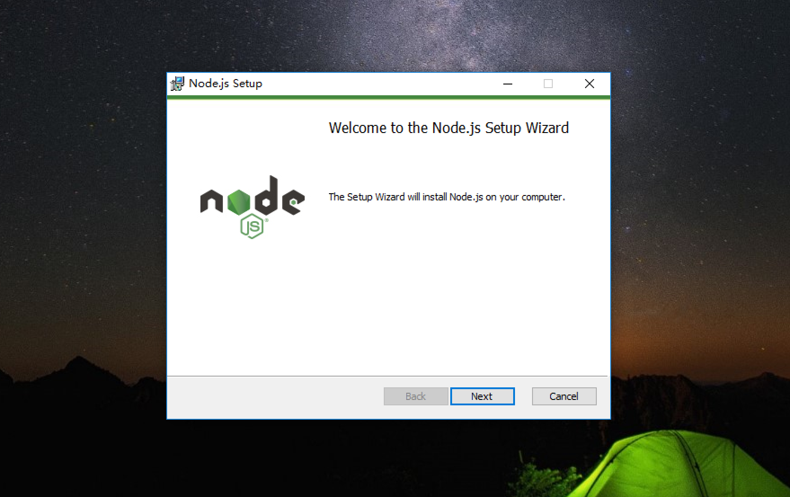

Node.js是一个Javascript运行环境(runtime environment)，发布于2009年5月，由Ryan Dahl开发，实质是对Chrome V8引擎进行了封装。本文详细介绍了Node.js的安装和使用。

<!--more-->

#### Node.js介绍

Node.js 不是一个 JavaScript [框架](https://baike.baidu.com/item/%E6%A1%86%E6%9E%B6/1212667)，不同于[CakePHP](https://baike.baidu.com/item/CakePHP/5930284)、[Django](https://baike.baidu.com/item/Django/61531)、[Rails](https://baike.baidu.com/item/Rails/10962333)。Node.js 更不是浏览器端的库，不能与 jQuery、ExtJS 相提并论。Node.js 是一个让 JavaScript 运行在[服务端](https://baike.baidu.com/item/%E6%9C%8D%E5%8A%A1%E7%AB%AF/6492316)的开发平台，它让 JavaScript 成为与[PHP](https://baike.baidu.com/item/PHP/9337)、[Python](https://baike.baidu.com/item/Python/407313)、[Perl](https://baike.baidu.com/item/Perl/851577)、[Ruby](https://baike.baidu.com/item/Ruby/11419) 等服务端语言平起平坐的[脚本语言](https://baike.baidu.com/item/%E8%84%9A%E6%9C%AC%E8%AF%AD%E8%A8%80/1379708)。

#### Node.js安装

##### 安装

###### windows环境安装Node.js

在浏览器地址栏输入`https://nodejs.org/en/`,  进入`Node.js`官网后，点击下载左边的稳定版本，如下图所示：

下载完成之后，开始安装，点击`Next`：

`Next`

如果不需要修改安装路径，`Next`

`Next`

`Install`

`Finish`

打开命令行工具，`开始`->`运行`->`cmd`->`回车`, 输入node，如果提示如下，则安装成功，否则需要手动配置环境变量，或者重新安装，安装成功后，我们可以进行JavaScript语言测试：

###### Mac环境安装Node.js

直接使用brew包管理器进行安装，并根据提示添加环境变量，然后输入node进行测试：

以上就是Node.js分别在Windows和Mac环境下的安装介绍。