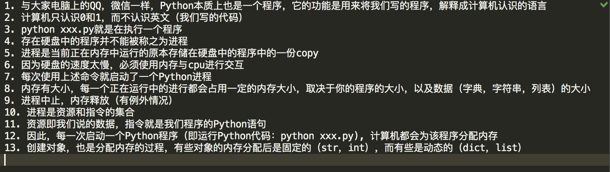

大多数情况下，我们不需要用到元类（元编程），但是在一些及特殊的时候，比如我需要控制类的创建行为时，就需要使用元编程了，本文详细介绍元编程思想

<!--more-->

#### 一切皆对象

开始学习元类，我们需要先回顾一些必备的基础知识，首先是**一切皆对象**这个概念，在学习Python这门语言之初，我们就已经知道，**Python中一切皆对象**。

##### 基础数据类型

```python
# 字符串是str类的对象
s = 'PythonS17'
print(type(s))

# 整型是int类的对象
i = 17
print(type(i))

# 字典
dic = dict(username='宋平平', age=18)
print(type(dic))

# 还有列表，元组，集合都是对象
```

##### 函数和类

```python
# 函数是function的对象
def foo():
    pass
print(type(foo))

# 类是type的对象
class HeiGe:pass
print(type(HeiGe))
```

##### int,str,function是谁的对象？

```python
# type是一切对象的类，即元类。在Python中所有对象都是type这个类的对象
def foo():
    pass
print(type(type(foo)))

s = '宁雅茹'
print(type(type(s)))
```

以上就是关于一切皆对象的简单回顾。

#### 什么是元编程

元编程是Python中非常重要的一个知识点，它使我们可以在对象的创建过程中加入一些自定制的，项目中实际需要的信息。

比如产品经理要我们根据用户手机壳颜色更换主题这种需求，也就是说官方提供的方法不能满足需求的时候，我们需要自定制对象的创建。

#### 内置方法`__call__`

想要搞清楚元编程，我们还需要回顾另外一个知识点，内置方法`__call__`。我们之前学过几个内置方法，先简单回顾一下，再来看看`__call__`方法。

##### `__getattribute__`

```python
# 对象的属性访问会触发__getattribute__方法执行
class User:
    def __init__(self, name):
        self.name = name
    
    def __getattribute__(self, name):
        print("__getattribute__ method execute")
        return super().__getattribute__(name)
    
u = User("Joe")
u.name
```

##### `__getitem__`

```python
# 如果希望实现对象的self[key]访问方式，可以自定义__getitem__方法
class User:
    def __init__(self, name):
        self.name = name
    
    def __getitem__(self, name):
        print("__getitem__ method execute")
        return self.name
    
u = User("Joe")
u.name
u['name']
```

##### `__call__`

```python
# 如果对象实现了__call__方法，则可称之为可调用对象
class User:
    def __call__(self):
        pass
    
u = User()
u()
```

小节一下，对象加括号u(), 就会执行该对象的类中的`__call__`方法，请记住这句话

##### 有哪些可调用对象

函数，类，函数加括号，比如

```python
def foo():
    pass

foo()  # 会调用函数的类function中的__call__方法
```

那么类呢？

```python
class Bar:
    pass

b = Bar()  # 会调用type中的__call__方法
b()  # 会调用Bar中的__call__方法(如果有)
```

#### 自定制基础对象的创建

在本文开始前，我提到，特殊的需求下，我们需要自定制对象的创建，但是简单的小程序，是不需要这样做的，最多自定制基础对象的创建即可，比如，我希望创建的字符串对象是可调用对象，请看

```python
# 原生的字符串对象是不具备可调用性的，我们需要自定制字符串对象
class MyStr(str):
    def __call__(self):
        print("__call__ method execute")
        
ms = MyStr()  # MyStr()会调用谁的__call__
ms()
```

或者，比如我希望我希望字符串实现hhh方法

```python
class MyStr(str):
    def hhh(self):
        print("hhh method execute")
        
ms = MyStr()  # MyStr()会调用谁的__call__
ms.hhh()
```

#### 使用class关键字创建对象

讲到这里，我们已经知道了，在小型程序中，Python提供给我们的工具（基础数据类型）已经足够使用了，最多，我们可以自定制（通过继承的方式）基础数据类型来实现复杂需求，但是这些数据类型无法描述我们丰富多彩的世界，无法满足产品经理日益增长的疯狂的想法，因此我们需要使用class关键字来描述更加丰富、实际的世界。class登场了。举例，我要描述黑哥这个人，他有哪些属性和方法呢？

```python
class HeiGe:
    pass
```

使用类来描述丰富多彩的世界使我们多了一个工具，面向对象编程通过使用继承、封装、多态这几个特性是我们编程更加得心应手。

#### 自定制类对象的创建

通过前面的回顾我们知道，对象加括号会执行对象所属类的`__call__`方法，我们还知道，类也是对象，Python在执行我们的代码时，当解析到class关键字，就会将该语句解析成 xxx = 元类()。所有创建类这个对象时，实际上执行了元类的`__call__`方法。

基于这一点，我们正式开始讨论元编程（终于到正题了）。

##### `__new__`

Python中一切对象的创建都是通过`__new__`来实现的，不管是字符串、整型、字典、列表、函数、类（特殊，可以创建对象）。

对象的创建过程是这样的，我们使用类来举例（使用class关键字时创建的对象）:

执行代码时遇到class关键字—>执行元类的`__call__`方法（大部分情况下是type)—>调用`__new__`方法创建对象—>调用`__init__`方法保存数据。

```python
# -*- coding: utf-8 -*-


class MyMetaClass(type):

    def __new__(cls, *args, **kwargs):
        # __new__方法有四个参数
        # __new__方法的第一个参数为当前元类
        # __new__方法的第二个参数为要创建的类对象的名称（字符串）
        # __new__方法的第三个参数为要创建的类对象继承的类对象（元组）
        # __new__方法的第四个参数为要创建的类对象的属性（字典）
        # 如果需要自定义类对象的创建，可以自定义__new__方法
        print("MyMetaClass __new__ execute")
        return type.__new__(cls, *args, **kwargs)

    def __call__(self, *args, **kwargs):
        print("MyMetaClass __call__ execute")
        return type.__call__(self, *args, **kwargs)


class Person(object, metaclass=MyMetaClass):
    '''
    Python中一切皆对象
    Python中所有对象都是由__new__方法创建的
    当Python解释器解释到class关键字时，开始创建类对象，此处为Person
    相当于 Person = MyMetaClass(), 或者type()
    对象加括号，即MyMetaClass()，会调用该对象的类的__call__方法
    注意，如果即MyMetaClass类中有__call__方法，该方法不会被调用，因为对象加括号，才会调用该对象的类的__call__方法
    要想自定义类实例对象的创建，可以自定义__new__方法
    '''
    def __new__(cls, *args, **kwargs):
        print("Person __new__ execute")
        return super().__new__(cls, *args, **kwargs)

    def __call__(self, *args, **kwargs):
        print("Person __call__ execute")


p = Person()
p()
```

##### 自定制类对象的创建

如果想自定制类的创建可以自定义一个元类继承type，然后重写`__new__`方法。

##### 自定制实例对象的创建

如果想自定制类对象的创建, 使用metaclass=MyMetaClass, 然后重写`__new__`方法。

#### 创建对象的本质



#### 总结

Python中的一切都是对象，它们要么是类的实例，要么是元类的实例，除了type。type实际上是它自己的元类，在纯Python环境中这可不是你能够做到的，这是通过在实现层面耍一些小手段做到的。其次，元类是很复杂的。下面的内容来自[这篇文章](https://www.pythontab.com/html/2015/pythonhexinbiancheng_0906/961.html)，详情请点击链接。

##### 究竟为什么要使用元类？

现在回到我们的大主题上来，究竟是为什么你会去使用这样一种容易出错且晦涩的特性？好吧，一般来说，你根本就用不上它：

“元类就是深度的魔法，99%的用户应该根本不必为此操心。如果你想搞清楚究竟是否需要用到元类，那么你就不需要它。那些实际用到元类的人都非常清楚地知道他们需要做什么，而且根本不需要解释为什么要用元类。”  —— Python界的领袖 Tim Peters

元类的主要用途是创建API。一个典型的例子是Django ORM。它允许你像这样定义：

```python
from django.db import models

class UserInfo(models.Model):
    name = models.CharField(max_length=30)
    age = models.IntegerField()
```

但是如果你像这样做的话：

```python
joe  = UserInfo(name='Joe', age='35')
print(joe.age)
```

这并不会返回一个IntegerField对象，而是会返回一个int，甚至可以直接从数据库中取出数据。这是有可能的，因为models.Model定义了__metaclass__， 并且使用了一些魔法能够将你刚刚定义的简单的Person类转变成对数据库的一个复杂hook。Django框架将这些看起来很复杂的东西通过暴露出一个简单的使用元类的API将其化简，通过这个API重新创建代码，在背后完成真正的工作。

后面，我将带领大家利用元编程来自定义自己的orm框架。