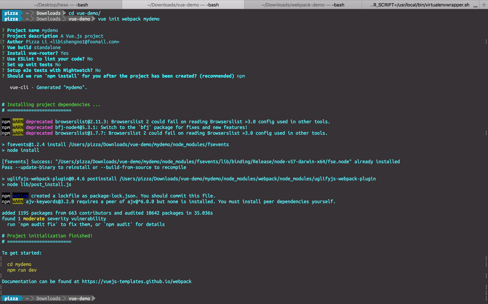
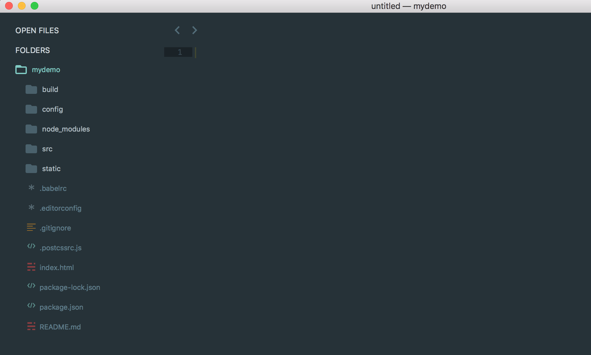
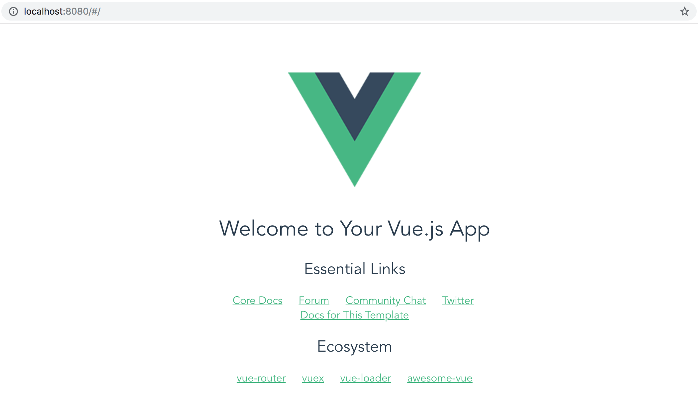
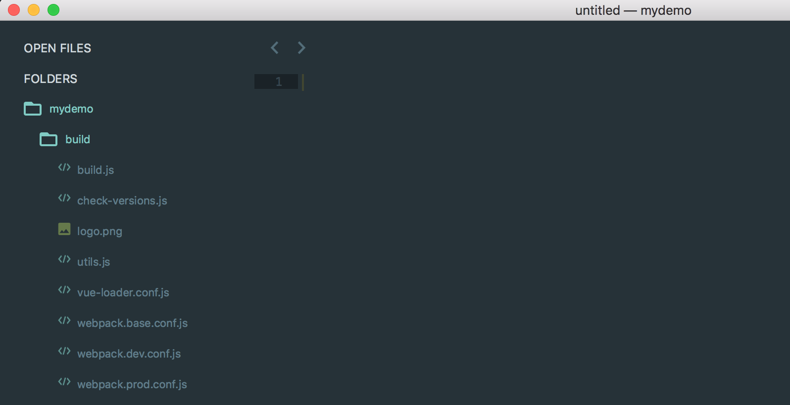
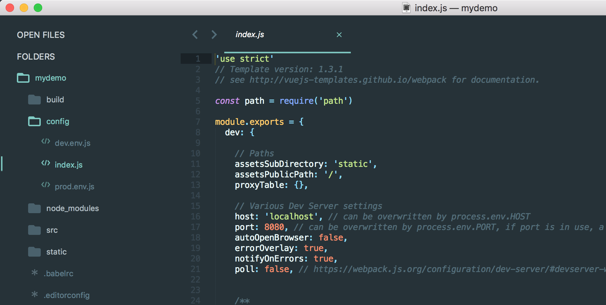
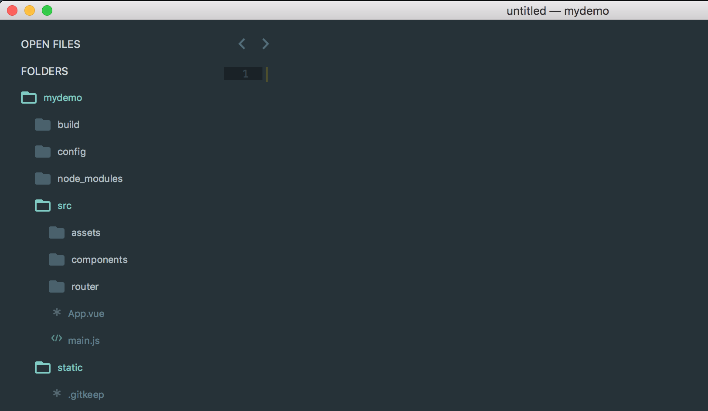
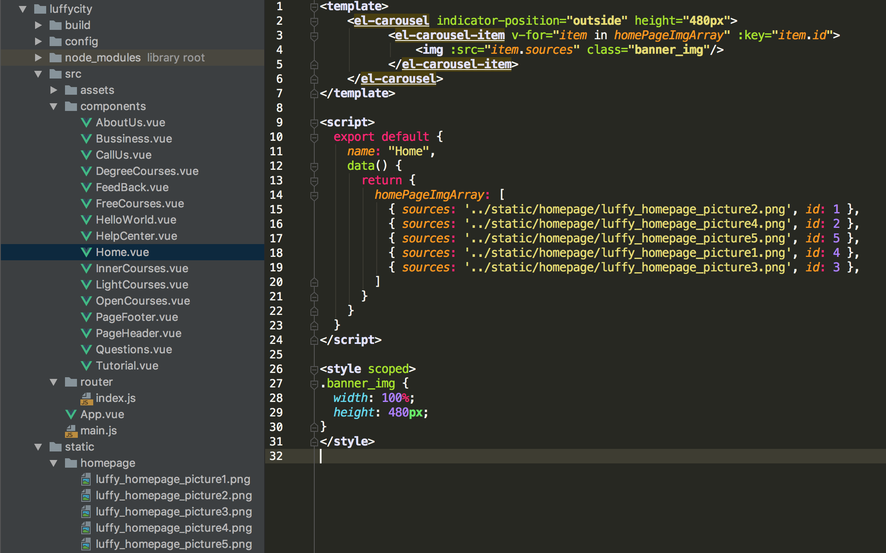
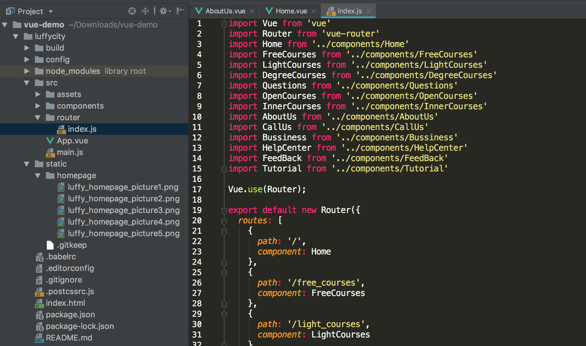
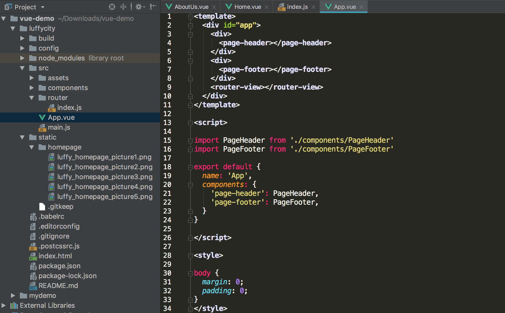
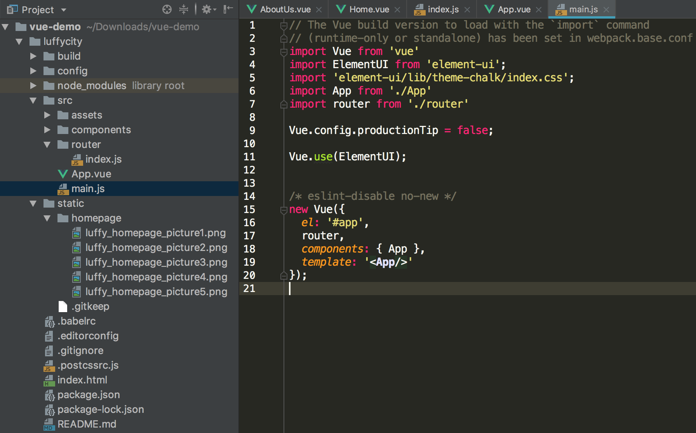

Vue CLI 是一个基于 Vue.js 进行快速开发的完整系统，Vue CLI 致力于将 Vue 生态中的工具基础标准化。它确保了各种构建工具能够基于智能的默认配置即可平稳衔接，这样你可以专注在撰写应用上，而不必花好几天去纠结配置的问题。与此同时，它也为每个工具提供了调整配置的灵活性。

<!--more-->

#### Vue CLI

##### 概念

通俗的说，Vue CLI是我们创建大型项目时的脚手架，所谓脚手架，就是帮助我们建设好了建造大厦的所需模板，建设者只需往模板里面填入实质内容，即可完成大厦的建设，对于程序开发来说，脚手架使程序员只需要关注业务逻辑的实现上面，我们不需要再关注兼容性问题，不需要再浪费时间在重复的工作上。

Vue Cli帮助我们快速构建大型web应用，提升了我们的开发效率，它基于webpack构建，并带有合理的默认配置。


##### 安装

我们使用npm安装Vue Cli，Vue Cli 2和Vue Cli 3的安装方式略有不同，因为Vue Cli 3将包名称由vue-cli改成了@vue/cli，下面我们分别使用全局和本地的方式安装Vue Cli2和版本3：

###### 全局安装

```
// 版本2
npm install -g vue-cli
// 版本3
npm install -g @vue/cli
```

###### 本地安装

```
// 版本2
npm install vue-cli --save
// 版本3
npm install @vue/cli --save
```


##### 构建我们的项目

安装好Vue Cli之后，下面我们来搭建一个项目。本文测试采用的是全局安装的Vue Cli 2版本。

进入项目环境，创建初始化项目:

- vue基于webpack构建项目
- mydemo是我们的项目名称



创建过程中，会出现提示是否需要安装VueRouter和单元测试等功能，根据你的项目实际需要输入Y/N即可。

构建完成之后，在项目根目录下会生成一个mydemo目录，然后根据提示，进入mydemo项目，我们的项目结构如下：



运行npm run dev, 出现如下提示后，在浏览器中访问http://localhost:8080。

```
npm run dev

> mydemo@1.0.0 dev /Users/pizza/Downloads/vue-demo/mydemo
> webpack-dev-server --inline --progress --config build/webpack.dev.conf.js

 95% emitting                                                                        

 DONE  Compiled successfully in 2403ms                                                                                              

 Your application is running here: http://localhost:8080
```

浏览器中会出现Vue的欢迎页面，如下图所示：



至此，我们的Vue项目构建完成了。下面解释一下项目根目录下的各目录和文件的功能。


##### 目录结构说明

###### build目录



build目录中的文件主要是用来进行webpack配置。

其中最重要的就是webpack.base.conf.js, webpack.dev.conf.js, webpack.prod.conf.js三个文件，分别是基本webpack配置、开发环境webpack配置、生产环境webpack配置。

npm run build命令是用来构建生产环境的，而build.js文件就是该命令的入口配置文件，主要用于生产环境。

###### config目录



config目录中的文件是用来配置项目测试和运行环境的。

在index.js文件中有一个proxyTable属性，该属性的属性值如果加上对应的后台地址和端口，就可以和后台进行联调。

###### static目录

static目录用来存储项目的静态文件。它是真正的静态资源，完全不被webpack处理。

###### src目录



src目录存放的是我们项目的源文件，它是整个项目使用频率最高的文件夹。

assets目录存放的是公共的资源，会被webpack当成模块资源处理；

components目录存放的是我们整个项目的所有组件；

router目录则存放的是我们整个项目的路由文件；

App.vue文件是所有vue文件的入口；

main.js对应App.vue 创建vue实例，也是入口文件，对应webpack.base.config.js里的入口配置文件。


##### 迁移我们的项目

接下来，我们将前面写的路飞学城项目迁移到Vue Cli的结构中。

###### 初始化一个luffycity项目

```
vue init webpack luffycity
```

初始化完成之后，在当前目录下面会出现一个luffycity的目录，目录结构与上述项目是一致的。我们即将项目填充进这个脚手架中。

###### 准备内容

并将图片存入static目录下, 如下图：



###### 配置路由

如下图：



###### 使用组件

如下图：



###### 配置Vue实例

创建Vue实例，配置路由组件，同时安装element-ui并导入，如下图：



最后使用命令npm run dev运行项目。至此我们已经将之前的项目完整的迁移到Vue Cli中。