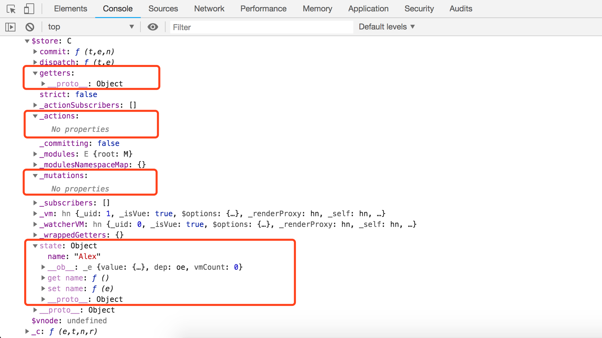
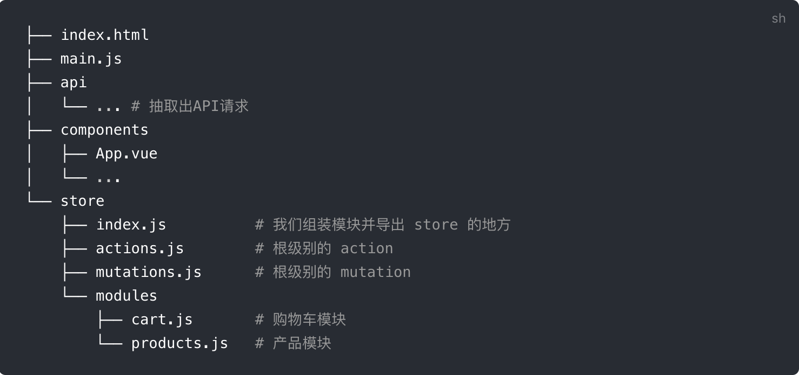

由于状态零散地分布在许多组件和组件之间的交互中，大型应用复杂度也经常逐渐增长。为了解决这个问题，Vue 提供 vuex。

<!--more-->

#### 什么是Vuex

Vuex 是一个专为 Vue.js 应用程序开发的**状态管理模式**。它采用集中式存储管理应用的所有组件的状态，并以相应的规则保证状态以一种可预测的方式发生变化。

状态，其实指的是实例之间的共享数据，Vuex是管理应用中不同Vue实例之间数据共享的工具。

下图是Vuex官方提供的对于状态管理模式的设计理念。


#### 为什么使用Vuex

通俗的讲，就是为了方便组件与组件之间的数据共享。

我们知道，父子组件之间想要共享数据，可以使用props属性，子父组件之间的通信可以使用$emit触发一个事件。

随着我们的web应用不断的丰富，组件之前通信采用的props和事件将会充斥着我们的整个项目，逻辑也会越来越复杂，程序员不得不将精力从业务逻辑的实现上转移到组件之间的通信上。日后的维护也会不断的复杂。

理论上，我们可以通过一个全局的共享数据来实现各个组件之间的数据共享，但是，当一个组件修改了这个全局数据时，其他组件对该全局数据的引用都会跟随者改变，并且不留下任何痕迹，这种实现方式，会导致调试变为噩梦。

这个时候，我们迫切需要一个管理组件之间数据的共享的工具，Vuex出现了。


#### 什么情况下我该使用Vuex


虽然 Vuex 可以帮助我们管理共享状态，但也附带了更多的概念和框架。这需要对短期和长期效益进行权衡。

如果您不打算开发大型单页应用，使用 Vuex 可能是繁琐冗余的。确实是如此——如果您的应用够简单，您最好不要使用 Vuex。一个简单的 [store 模式](https://cn.vuejs.org/v2/guide/state-management.html#%E7%AE%80%E5%8D%95%E7%8A%B6%E6%80%81%E7%AE%A1%E7%90%86%E8%B5%B7%E6%AD%A5%E4%BD%BF%E7%94%A8)就足够您所需了。但是，如果您需要构建一个中大型单页应用，您很可能会考虑如何更好地在组件外部管理状态，Vuex 将会成为自然而然的选择。


#### 如何使用Vuex

每一个 Vuex 应用的核心就是 store（仓库）。“store”基本上就是一个容器，它包含着你的应用中大部分的**状态 (state)**。Vuex 和单纯的全局对象有以下两点不同：

- Vuex 的状态存储是响应式的。当 Vue 组件从 store 中读取状态的时候，若 store 中的状态发生变化，那么相应的组件也会相应地得到高效更新。
- 你不能直接改变 store 中的状态。改变 store 中的状态的唯一途径就是显式地**提交 (commit) mutation**。这样使得我们可以方便地跟踪每一个状态的变化，从而让我们能够实现一些工具帮助我们更好地了解我们的应用。


##### 安装

本文使用npm安装vuex，初始化一个vuex项目目录，然后：

```
npm install vuex --save
```

也可以直接下载vuex.js，然后在script标签中引用。


##### 开始使用

```
<!DOCTYPE html>
<html lang="en">
<head>
  <meta charset="UTF-8">
  <title>Title</title>
  <script src="./node_modules/vue/dist/vue.min.js"></script>
  <script src="./node_modules/vuex/dist/vuex.min.js"></script>
</head>
<body>
  <div id="app"></div>
  <script>

    Vue.use(Vuex);

    const myStore = new Vuex.Store({
      state: {
        name: "Alex",
      },
      mutations: {},
      getters: {},
      actions: {}
    });

    let App = {
      template: `
        <div>
          <p>{{ name }}</p>
        </div>
      `,
      computed: {
        name: function () {
          return this.$store.state.name;
        },
      }
    };

    new Vue({
      el: "#app",
      store: myStore,
      template: `<app></app>`,
      components: {
        'app': App,
      },
    })
  </script>

</body>
</html>
```


在以上代码中，我们使用Vue.use(Vuex)告诉Vue实例使用Vuex进行状态管理，并使用Vuex.Store创建了一个Vuex实例，上文提到，Store是Vuex的核心，它是一个容器，包含了几个核心属性。打印一下Vue实例对象，我们可以看到这几个核心属性，如下图：



创建Vue实例时将新建的Vuex实例注册到Vue实例中，即可在Vue实例中查看到$store属性。四个核心属性都已经创建好了。


##### 核心概念

接下来，我们需要理解Vuex中的几个核心概念。

###### State

用来存放组件之间共享的数据。他跟组件的data选项类似，只不过data选项是用来存放组件的私有数据。

###### Getter

有时候，我们需要对state的数据进行筛选，过滤。这些操作都是在组件的计算属性进行的。

如果多个组件需要用到筛选后的数据，那我们就必须到处重复写该计算属性函数，或者将其提取到一个公共的工具函数中，并将公共函数多处导入 - 两者都不太理想。

如果把数据筛选完在传到计算属性里就不用那么麻烦了，这就是getter的作用，来看下面的代码：

```
<!DOCTYPE html>
<html lang="en">
<head>
  <meta charset="UTF-8">
  <title>Title</title>
  <script src="./node_modules/vue/dist/vue.min.js"></script>
  <script src="./node_modules/vuex/dist/vuex.min.js"></script>
</head>
<body>
  <div id="app"></div>

  <script>
    Vue.use(Vuex);

    const store = new Vuex.Store({
      state: {
        name: "Pizza",
        age: 22,
      },
      getters: {
        getAge: function (state) {
          return state.age + 1;
        }
      }
    });

    let App = {
      template: `
        <div>
          <span>{{ name  }}</span>
          <span>{{ age }}</span>
        </div>
      `,
      computed: {
        name: function () {
          return this.$store.state.name;
        },
        age: function () {
          return this.$store.getters.getAge;
        }
      },
    };

    new Vue({
      el: "#app",
      template: `<App></App>`,
      store: store,
      components: {
        App
      }
    })
  </script>

</body>
</html>
```

注意在getters中getAge必须使用state访问数据，而不是this。

在计算属性中，我们使用this.$store.getters.getAge来访问需要计算的数据。

###### Mutation

前面讲到的都是如何获取state的数据，那如何把数据存储到state中呢？

在 Vuex store 中，实际改变状态(state) 的唯一方式是通过提交(commit) 一个 mutation。

mutations下的函数接收state作为第一个参数，接收payload作为第二个参数，payload是用来记录开发者使用该函数的一些信息，有一点需要注意：**mutations方法必须是同步方法**！

请看下面的代码：

```
<!DOCTYPE html>
<html lang="en">
<head>
  <meta charset="UTF-8">
  <title>Title</title>
  <script src="./node_modules/vue/dist/vue.min.js"></script>
  <script src="./node_modules/vuex/dist/vuex.min.js"></script>
</head>
<body>
  <div id="app"></div>

  <script>
    Vue.use(Vuex);

    const store = new Vuex.Store({
      state: {
        name: "Pizza",
        age: 18,
        score: 100,
        hobby: ["girls", "books"]
      },
      mutations: {
        score: function (state, payload) {
          console.log("state: ", state);
          console.log("payload: ", payload);
          return state.score -= 10;
        },
        hobby: function (state, payload) {
          return state.hobby.push(payload);
        }
      },
      getters: {
        getAge: function (state) {
          return state.age + 1;
        }
      }
    });

    let App = {
      template: `
        <div>
          <p>{{ name }}</p>
          <p>{{ age }}</p>
          <p>{{ score }}</p>
          <p>{{ hobby }}</p>
          <button @click="changeScore">点击修改分数</button>
          <button @click="changeHobby">点击修改爱好</button>
      `,
      computed: {
        name: function () {
          return this.$store.state.name;
        },
        age: function () {
          return this.$store.state.age;
        },
        score: function () {
          return this.$store.state.score;
        },
        hobby: function () {
          return this.$store.state.hobby;
        }
      },
      methods: {
        changeScore: function () {
          this.$store.commit('score', 10);
        },
        changeHobby: function () {
          this.$store.commit('hobby', 'movie')
        }
      }
    };

    new Vue({
      el: "#app",
      template: `<App></App>`,
      components: {
        App
      },
      store
    })
  </script>

</body>
</html>
```

我们提交了一个this.$store.commit("score", 10)，传入的第一个参数指的是mutations中定义的参数，第二个参数是需要变更的数据。

###### Action

Actions用来处理异步事务。

Actions 提交的是 mutations，而不是直接变更状态。也就是说，actions会通过mutations，让mutations帮他提交数据的变更。

Action 可以包含任意异步操作。比如ajax、setTimeout、setInterval。继续看下面的代码：

```
<!DOCTYPE html>
<html lang="en">
<head>
  <meta charset="UTF-8">
  <title>Title</title>
  <script src="./node_modules/vue/dist/vue.min.js"></script>
  <script src="./node_modules/vuex/dist/vuex.min.js"></script>
</head>
<body>
  <div id="app"></div>

  <script>
    Vue.use(Vuex);

    const store = new Vuex.Store({
      state: {
        name: 'Pizza',
        age: 18,
        score: 90,
      },
      mutations: {
        changeScoreAsync: function (state, payload) {
          return state.score += payload;
        }
      },
      actions: {
        addScore: function (context, payload) {
          setTimeout(() => context.commit("changeScoreAsync", payload), 3000);
        }
      }
    });

    let App = {
      template: `
        <div>
          <span>{{ name }}</span>
          <span>{{ age }}</span>
          <span>{{ score }}</span>
          <button @click="changeScore">点击一会儿修改数据</button>
      `,
      computed: {
        name: function () {
          return this.$store.state.name;
        },
        age: function () {
          return this.$store.state.age;
        },
        score: function () {
          return this.$store.state.score;
        },
      },
      methods: {
        changeScore: function () {
          this.$store.dispatch("addScore", 1);
        }
      }
    };

    new Vue({
      el: "#app",
      template: `<App></App>`,
      store,
      components: {
        App
      }
    })
  </script>

</body>
</html>
```

点击修改数据后，this.$store.dispatch找到actions中定义的方法，并将当前状态的store对象封装，传递给actions中函数的第一个参数context，随后由context.commit提交修改。

##### 项目结构

Vuex 并不限制你的代码结构。但是，它规定了一些需要遵守的规则：

- 应用层级的状态应该集中到单个 store 对象中；
- 提交 **mutation** 是更改状态的唯一方法，并且这个过程是同步的；
- 异步逻辑都应该封装到 **action** 里面。

只要你遵守以上规则，如何组织代码随你便。如果你的 store 文件太大，只需将 action、mutation 和 getter 分割到单独的文件。

对于大型应用，我们会希望把 Vuex 相关代码分割到模块中。下面是项目结构示例：




以上，就是关于Vuex的使用介绍。