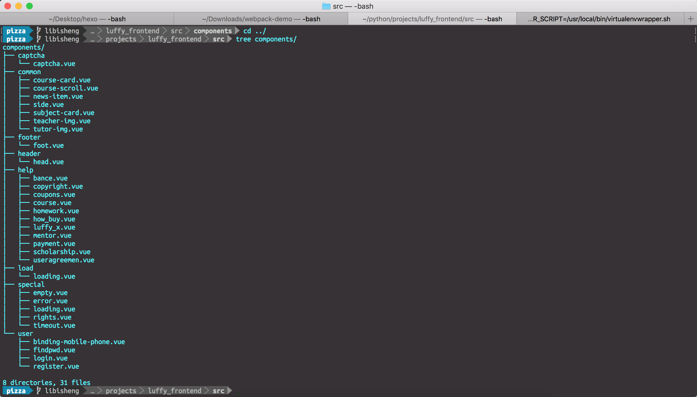
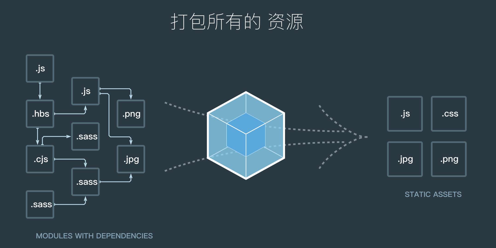
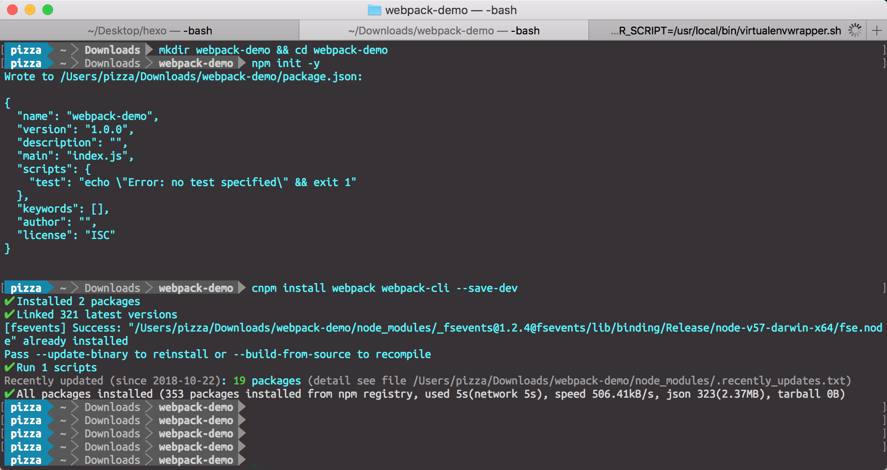
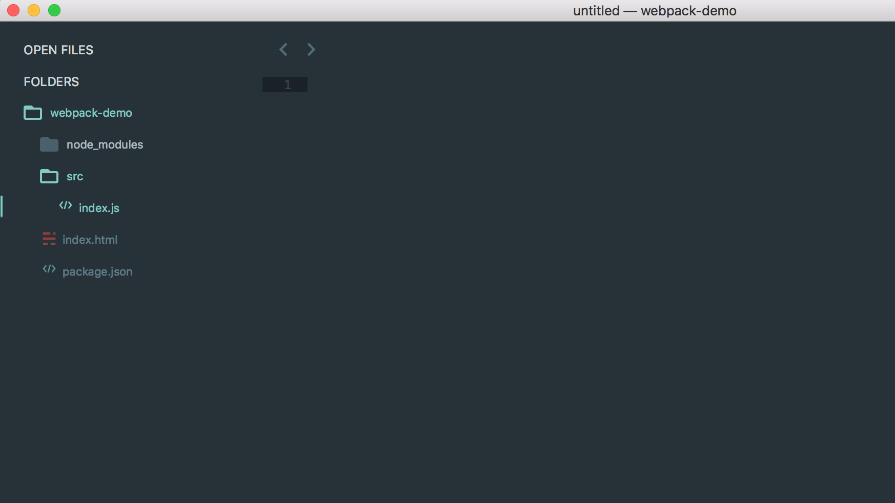
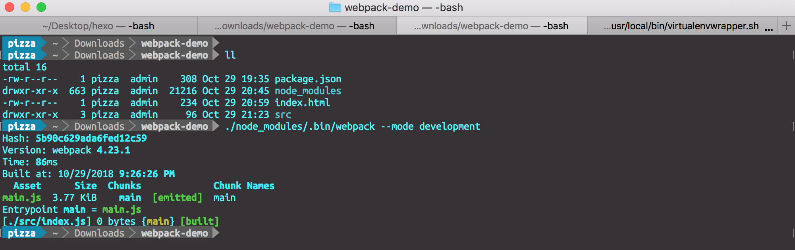
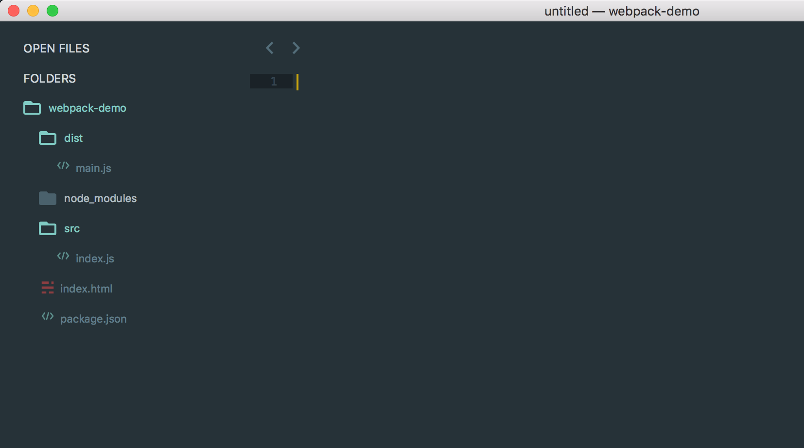
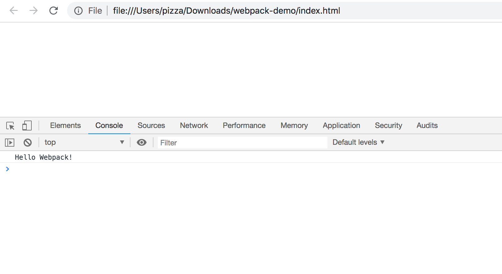
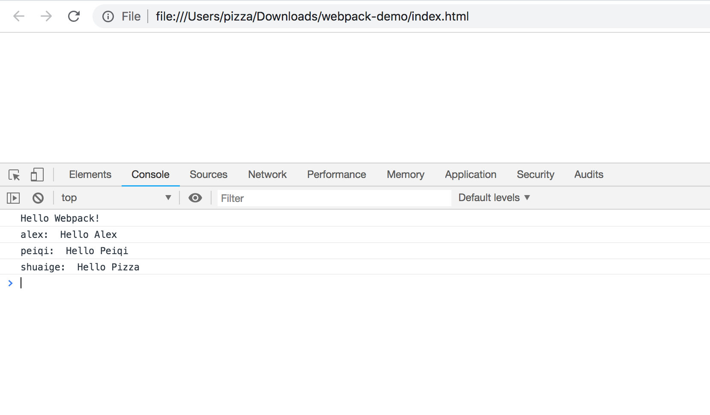

本质上，Webpack是一个现代 JavaScript应用程序的**静态模块打包器(module bundler)**。当 Webpack处理应用程序时，它会递归地构建一个**依赖关系图(dependency graph)**，其中包含应用程序需要的每个模块，然后将所有这些模块打包成一个或多个bundle。

<!--more-->


##### 什么是模块化编程

模块化编程是一种软件设计技术。

在[模块化编程](https://en.wikipedia.org/wiki/Modular_programming)中，开发者将程序分解成离散功能块，并称之为*模块*。

每个模块具有比完整程序更小的接触面，使得校验、调试、测试轻而易举。 精心编写的*模块*提供了可靠的抽象和封装界限，使得应用程序中每个模块都具有条理清楚的设计和明确的目的。

下面参考一下路飞前端项目各个组件的分布结构：



可以看到，不同的业务逻辑，不同的页面内容，应该分隔在不同的文件(模块)中。这样更加方便日后的调试与维护。

Node.js从最一开始就支持模块化编程。然而，在 web，*模块化*的支持正缓慢到来。在 web 存在多种支持 JavaScript 模块化的工具，这些工具各有优势和限制。webpack 基于从这些系统获得的经验教训，并将*模块*的概念应用于项目中的任何文件。


##### 为什么使用模块化编程

模块化编程使我们能够把某一类功能组合成一个独立的文件，然后对外提供一个接口，这种方式更加简化了各个业务功能之间的协作关系，方便日后的维护和扩展。


##### Webpack的工作方式

Webpack会把我们的项目当做一个整体，通过一个给定的主文件（如：index.js），Webpack将从这个文件开始找到你的项目的所有依赖文件，使用loaders处理它们，最后打包为一个（或多个）浏览器可识别的JavaScript文件，如下图所示：



##### 安装Webpack

```
npm install -g webpack webpack-cli
或者
npm install webpack webpack-cli --save
```

此时我们可以看到，在package.json文件中，已经有Webpack了：



Webpack-cli工具用于在命令行中运行Webpack.


##### 几个重要概念

###### 入口文件

**入口起点(entry point)**指示 Webpack 应该使用哪个模块，来作为构建其内部*依赖图*的开始。进入入口起点后，Webpack 会找出有哪些模块和库是入口起点（直接和间接）依赖的。

每个依赖项随即被处理，最后输出到称之为 *bundles* 的文件中。

###### 出口文件

出口文件告诉 Webpack 在哪里输出它所创建的 bundles，以及如何命名这些文件，默认值为dist。基本上，整个应用程序结构，都会被编译到你指定的输出路径的文件夹中。

###### loader

loader让 webpack 能够去处理那些非 JavaScript 文件（webpack 自身只理解 JavaScript）。loader 可以将所有类型的文件转换为 webpack 能够处理的有效[模块](https://www.webpackjs.com/concepts/modules)，然后你就可以利用 webpack 的打包能力，对它们进行处理。

本质上，webpack loader 将所有类型的文件，转换为应用程序的依赖图（和最终的 bundle）可以直接引用的模块。


##### Demo

下面，我们使用上面的目录结构，并根据Webpack的上述几个概念，来写一个简单的Demo程序。

在webpack-demo目录下面创建一个src目录，用于存放我们程序的原始文件如src/index.js，然后在webpack-demo目录下面创建一个index.html文件，用于使用打包后的出口文件，新的目录结构如下：



我们在index.html文件中写入最基础的html代码，它在这里目的在于引入打包后的js文件，Webpack4默认的输出文件为dist/main.js。

```
<!-- index.html -->
<!DOCTYPE html>
<html lang="en">
  <head>
    <meta charset="utf-8">
    <title>Webpack Sample Project</title>
  </head>
  <body>
    <div id='root'>
    </div>
    <script src="./dist/main.js"></script>
  </body>
</html>
```

然后在index.js中写入如下代码：

```
// index.js
let greeting = "Hello Webpack!";

console.log(greeting);
```

最后，使用Webpack将该项目打包。


##### 正式使用Webpack

###### Webpack3打包

Webpack3可以在终端中使用，在基本的使用方法如下：

```
webpack {entry file} {destination for bundled file}
```

指定入口文件后，Webpack将自动识别项目所依赖的其它文件，不过需要注意的是如果你的Webpack不是全局安装的，那么当你在终端中使用此命令时，需要额外指定其在node_modules中的地址，继续上面的例子，在终端中输入如下命令:

webpack3非全局安装的情况下打包

```
./node_modules/.bin/webpack ./src/index.js destination/bundle.js
```

webpack3全局安装的情况下打包

```
webpack ./src/index.js destination/bundle.js
```

###### Webpack4打包

Webpack4增加了模式区分

```
webpack --mode development/production 进行模式切换
  	development 开发者模式 打包默认不压缩代码
	production  生产者模式 上线时使用，压缩代码。 默认是这个模式
```

Webpack4固定入口目录为src，入口文件必须为index.js，打包后文件在新增的dist目录下, 出口文件为main.js，开始打包。




新的文件结构如下：




然后我们打开index.html文件的控制台, 可以看到如下结果：



##### 使用webpack进行ES6的模块化编程

在介绍ES6常用语法时，我们介绍过 ，ES6引入了模块化编程的概念，下面，我们继续使用上面的demo程序来测试ES6中的模块化编程。

在src目录下面新建一个sayhello.js文件，并加入如下代码：

```
// sayhello.js

let alex = "Hello Alex";
let peiqi = "Hello Peiqi";

let pizza = "Hello Pizza";

export {alex, peiqi};

export default pizza;
```

随后在index.js中import：

```
// index.js
let greeting = "Hello Webpack!";

console.log(greeting);

import {alex, peiqi} from "./sayhello.js";

import shuaige from "./sayhello.js";

console.log("alex: ", alex);
console.log("peiqi: ", peiqi);
console.log("shuaige: ", shuaige);
```

重新打包项目，并查看index.html：



注意，每一个文件只能有一个export default，import会将没有命中的变量名映射到export default导出的数据上面。


以上就是关于Webpack的知识。